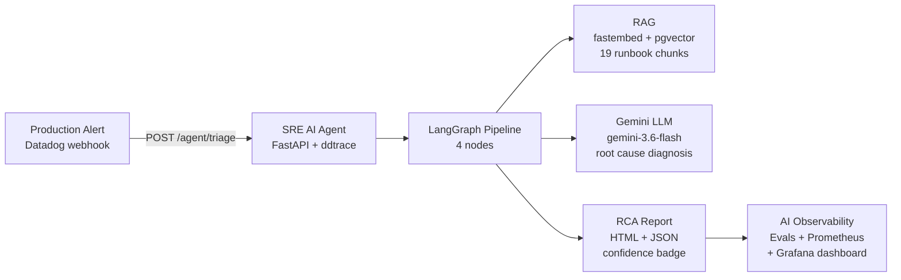
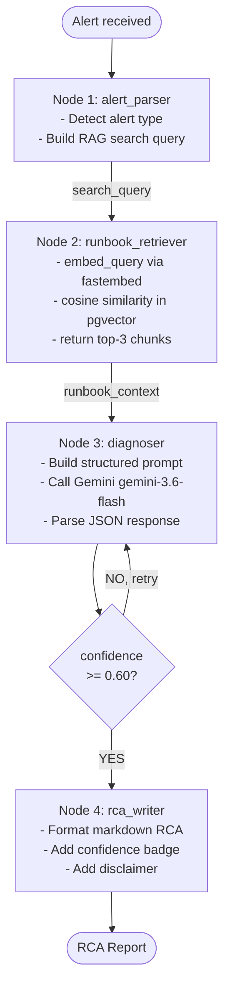
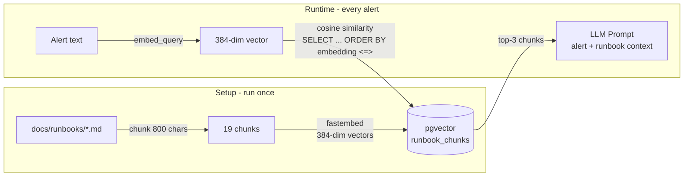
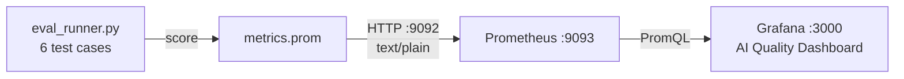
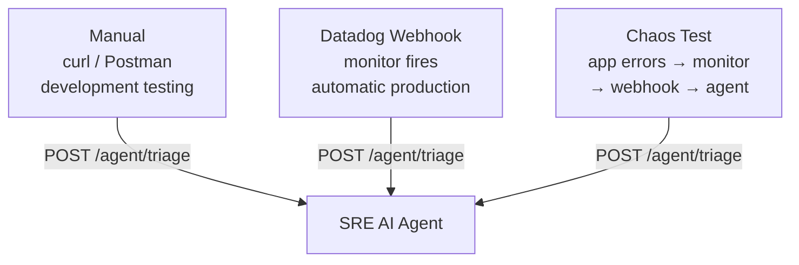

# SRE AI Agent Observability Platform

[](https://python.org)
[](https://github.com/langchain-ai/langgraph)
[](https://fastapi.tiangolo.com)
[](https://github.com/pgvector/pgvector)
[](https://ai.google.dev)
[](https://datadoghq.com)
[](https://prometheus.io)
[](https://grafana.com)
[](LICENSE)

> **AIOps platform** — LangGraph-powered SRE agent that automatically triages production alerts, retrieves runbooks via RAG, generates structured RCA reports, and monitors AI quality with Prometheus + Grafana.

---

## What This Project Does



**In plain English:** Alert fires → agent finds the right runbook → LLM diagnoses root cause → structured RCA report generated. Automatically. No human in the loop.

**Best result:** Pod Restart (OOMKilled) alert → **95% confidence** diagnosis with exact kubectl remediation steps.

---

## Live Demo

| Endpoint | What it does |
|---|---|
| `POST /agent/triage` | Trigger the full agent pipeline |
| `GET /agent/rca/{id}/html` | View styled HTML RCA report |
| `GET /agent/history` | List all past triage runs |
| `GET /agent/health` | Health check |
| `GET /docs` | Swagger UI (interactive API docs) |

**Sample request:**
```bash
curl -X POST http://localhost:8001/agent/triage \
  -H "Content-Type: application/json" \
  -d '{
    "alert_name": "Pod Restart Rate High",
    "severity": "P2",
    "service": "sre-ai-agent",
    "message": "Pod restarted 5 times in last 10 minutes, OOMKilled"
  }'
```

**Sample response (confidence: 95%):**
```json
{
  "status": "success",
  "incident_id": "INC-20260913-070056-49B454",
  "runbook_used": "pod-restarts.md",
  "confidence": 0.95,
  "html_url": "http://localhost:8001/agent/rca/INC-20260913-070056-49B454/html"
}
```

---

## Project Structure

```
SRE-AI-Agent-Observability/
│
├── agent/                          # LangGraph SRE Agent
│   ├── main.py                     # FastAPI entry point + HTML RCA endpoint
│   ├── state.py                    # LangGraph shared state schema
│   ├── graph.py                    # 4-node state machine wiring
│   ├── requirements.txt            # Agent dependencies
│   └── nodes/
│       ├── alert_parser.py         # Node 1 — classify alert type
│       ├── runbook_retriever.py    # Node 2 — RAG runbook search
│       ├── diagnoser.py            # Node 3 — Gemini LLM diagnosis
│       └── rca_writer.py           # Node 4 — format RCA report
│
├── rag/                            # RAG Pipeline
│   ├── embeddings.py               # fastembed wrapper (BAAI/bge-small-en-v1.5)
│   ├── indexer.py                  # Index runbooks into pgvector
│   └── retriever.py                # Cosine similarity search
│
├── vector-db/
│   └── init.sql                    # pgvector schema (vector(384), ivfflat index)
│
├── evals/                          # AI Quality Evals
│   ├── test_cases.json             # 6 ground truth test cases
│   ├── eval_runner.py              # Run evals + score + export to Prometheus
│   └── metrics.py                  # Prometheus metric definitions
│
├── docs/
│   ├── runbooks/                   # 4 SRE runbooks (indexed into pgvector)
│   │   ├── api-5xx.md
│   │   ├── api-availability.md
│   │   ├── high-latency.md
│   │   └── pod-restarts.md
│   ├── PHASE19_COMPLETE_GUIDE.md   # Phase 19 build guide
│   ├── PHASE19_QA_INTERVIEW_GUIDE.md # Interview Q&A
│   ├── PHASE20_COMPLETE_GUIDE.md   # Phase 20 build guide
│   └── COMPLETE_PROJECT_OVERVIEW.md # Full Phase 1-20 journey
│
├── monitoring/
│   ├── prometheus/
│   │   └── prometheus.yml          # Scrape config (port 9093)
│   └── grafana/
│       └── sre-ai-agent-dashboard.json  # AI Quality Dashboard JSON
│
├── infrastructure/
│   ├── helm/datadog/               # Datadog agent Helm values
│   └── terraform/
│       ├── eks/                    # EKS + VPC + ECR
│       ├── dns/                    # Route53 DNS
│       ├── datadog/                # Monitors, SLOs, dashboards as code
│       └── ai/                     # (Phase 21+) AI infra
│
├── kubernetes/                     # K8s manifests
├── scripts/                        # infra-up/down, load-secrets
└── .github/workflows/ci.yml        # GitHub Actions CI/CD
```

---

## Architecture Deep-Dive

### LangGraph Agent Pipeline



### RAG Pipeline



### AI Observability Pipeline



---

## Tech Stack

| Layer | Technology | Purpose |
|---|---|---|
| **Agent Framework** | LangGraph 0.2.28 | 4-node stateful AI pipeline |
| **LLM** | Gemini gemini-3.6-flash | Root cause diagnosis |
| **Embeddings** | fastembed BAAI/bge-small-en-v1.5 | Local 384-dim embeddings |
| **Vector DB** | pgvector (PostgreSQL 17) | Runbook chunk storage + search |
| **API** | FastAPI 0.115 + uvicorn | REST API for agent |
| **APM** | ddtrace → Datadog | Every request traced |
| **Evals** | Custom + prometheus_client | AI quality measurement |
| **Metrics** | Prometheus | Time series storage |
| **Dashboard** | Grafana | AI quality visualisation |
| **Cloud** | AWS EKS + ECR + VPC | Production deployment |
| **IaC** | Terraform | All infrastructure as code |
| **CI/CD** | GitHub Actions | Auto build + deploy |

---

## Results

### Eval Results (best run)

| Alert | Runbook Retrieved | Confidence |
|---|---|---|
| **Pod Restart (OOMKilled)** | pod-restarts.md ✅ | **95%** ⭐ |
| High Error Rate | api-5xx.md ✅ | 30% |
| High p99 Latency | high-latency.md ✅ | 30% |
| API Availability | api-availability.md ✅ | 10% |

### Grafana Dashboard Metrics

| Metric | Value | Target | Status |
|---|---|---|---|
| Context Recall | 100% | > 85% | ✅ |
| RCA Completeness | 67% | > 90% | 🟡 |
| Keyword Hit Rate | 75% | > 75% | ✅ |
| Avg Confidence | 24% | > 60% | ⚠️ rate limited |

> **Note:** Low average confidence is due to Gemini free tier rate limiting (20 req/day).
> Individual alert confidence depends on specificity — OOMKilled = 95%, generic alerts = 30%.

---

## Getting Started

### Prerequisites

- Python 3.12
- Docker + Rancher Desktop (or Docker Desktop)
- WSL2 Ubuntu (Windows) or Linux/macOS
- Gemini API key (free at [aistudio.google.com](https://aistudio.google.com/apikey))

### 1. Clone and setup

```bash
git clone https://github.com/Machindra220/SRE-AI-Agent-Observability.git
cd SRE-AI-Agent-Observability

python3.12 -m venv .venv
source .venv/bin/activate
pip install -r agent/requirements.txt
```

### 2. Create `.env` file

```bash
cat > .env << 'EOF'
GEMINI_API_KEY=your-gemini-api-key-here
PGHOST=localhost
PGPORT=5432
PGDATABASE=sre_agent
PGUSER=sre_user
PGPASSWORD=sre_pass
EOF
```

### 3. Start pgvector

```bash
docker run -d \
  --name pgvector \
  -e POSTGRES_DB=sre_agent \
  -e POSTGRES_USER=sre_user \
  -e POSTGRES_PASSWORD=sre_pass \
  -p 5432:5432 \
  pgvector/pgvector:pg17
```

### 4. Initialize database and index runbooks

```bash
export $(cat .env | grep -v '^#' | xargs)

# Create schema
PGPASSWORD=sre_pass psql -h localhost -U sre_user -d sre_agent \
  -f vector-db/init.sql

# Index runbooks (one-time)
python -m rag.indexer

# Verify 19 chunks indexed
PGPASSWORD=sre_pass psql -h localhost -U sre_user -d sre_agent \
  -c "SELECT source, COUNT(*) FROM runbook_chunks GROUP BY source;"
```

### 5. Start the agent

```bash
uvicorn agent.main:app --host 0.0.0.0 --port 8001 --reload
```

Open API docs: **http://localhost:8001/docs**

### 6. Test with an alert

```bash
curl -X POST http://localhost:8001/agent/triage \
  -H "Content-Type: application/json" \
  -d '{
    "alert_name": "Pod Restart Rate High",
    "severity": "P2",
    "service": "sre-ai-agent",
    "message": "Pod restarted 5 times in last 10 minutes, OOMKilled"
  }'
```

### 7. View HTML RCA report

Copy the `html_url` from the response and open in browser.

---

## AI Observability Setup

### Start Prometheus + Grafana

```bash
# Start Prometheus (port 9093 to avoid conflicts)
docker run -d --name sre-prometheus -p 9093:9090 \
  -v $(pwd)/monitoring/prometheus/prometheus.yml:/etc/prometheus/prometheus.yml \
  prom/prometheus:latest

# Start Grafana (or use existing on port 3000)
docker run -d --name sre-grafana -p 3000:3000 \
  -e GF_SECURITY_ADMIN_PASSWORD=admin \
  grafana/grafana:latest

# Serve metrics file
python3 /tmp/metrics_server.py &
```

### Run evals

```bash
# Agent must be running first
python -m evals.eval_runner
```

### Import Grafana dashboard

1. Go to `http://localhost:3000`
2. Dashboards → Import → Upload `monitoring/grafana/sre-ai-agent-dashboard.json`
3. Select `SRE-AI-Agent-Prometheus` as data source

---

## How Alerts Reach the Agent

Three ways to trigger the agent:



**For Datadog webhook:** Configure in Datadog → Monitor → Notify → add webhook URL pointing to `/agent/triage`.

---

## Interview Q&A

This project was built to demonstrate skills for **SRE for AI Platform** roles.

See [`docs/PHASE19_QA_INTERVIEW_GUIDE.md`](docs/PHASE19_QA_INTERVIEW_GUIDE.md) for 40+ interview questions and answers covering:
- LangGraph, RAG, LLM, pgvector, embeddings
- SRE concepts (SLOs, golden signals, incident handling)
- AI Platform concepts (evals, prompt engineering, hallucination)

---

## Related Project

This repo extends the foundational SRE platform:
**[sre-observability-eks-datadog](https://github.com/Machindra220/sre-observability-eks-datadog)** — 18-phase SRE platform on AWS EKS with Datadog (Phases 1-18)

---

## Documentation

| Document | Description |
|---|---|
| [PHASE19_COMPLETE_GUIDE.md](docs/PHASE19_COMPLETE_GUIDE.md) | Phase 19 build guide with all learnings |
| [PHASE19_QA_INTERVIEW_GUIDE.md](docs/PHASE19_QA_INTERVIEW_GUIDE.md) | 40+ interview Q&A with mermaid diagrams |
| [PHASE20_COMPLETE_GUIDE.md](docs/PHASE20_COMPLETE_GUIDE.md) | Phase 20 build guide with failures and fixes |
| [COMPLETE_PROJECT_OVERVIEW.md](docs/COMPLETE_PROJECT_OVERVIEW.md) | Full Phase 1-20 journey |
| [PHASE19_20_GUIDE.md](docs/PHASE19_20_GUIDE.md) | Concepts guide for beginners |

---

## Author

**Machindra** — SRE / Cloud Operations Engineer
- 10 years experience in IT/SRE/Cloud Operations
- Domain: [machindra.online](https://machindra.online)
- GitHub: [Machindra220](https://github.com/Machindra220)

---

*Built as a real-world AIOps portfolio project demonstrating LangGraph, RAG, pgvector, LLM evals, and AI observability.*