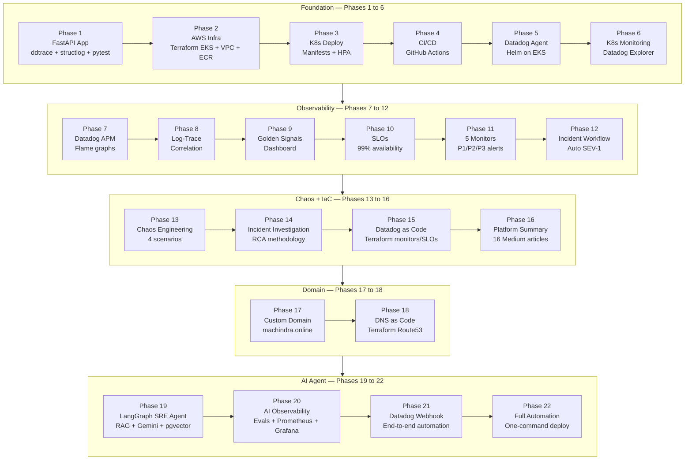
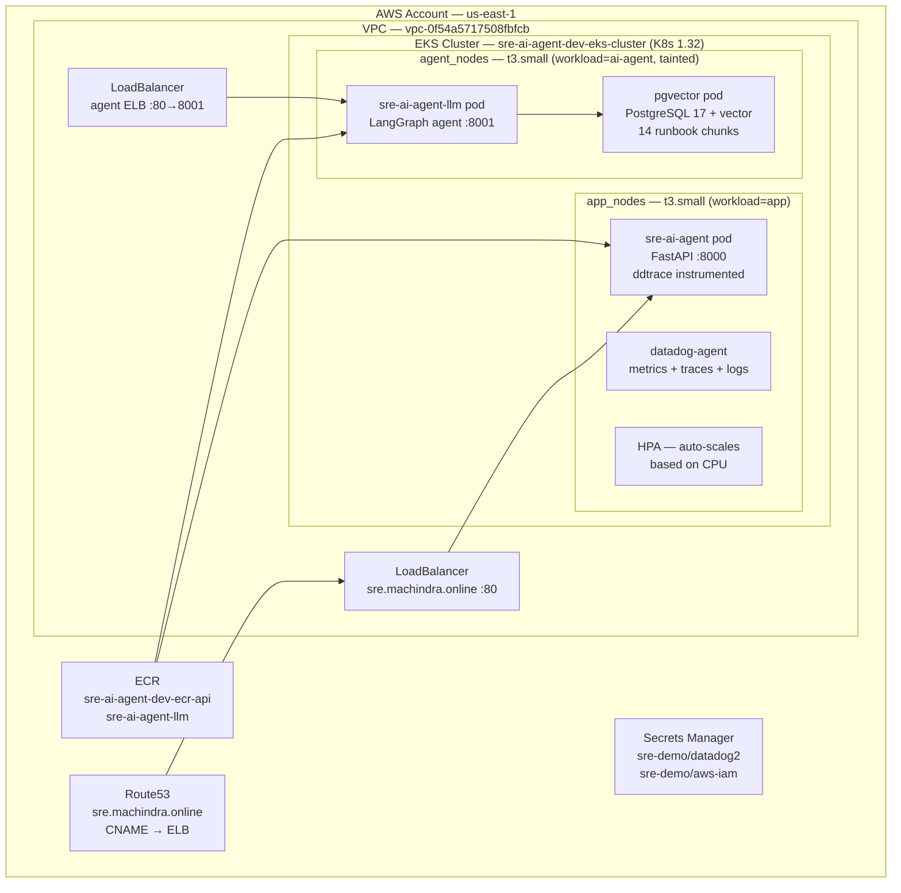
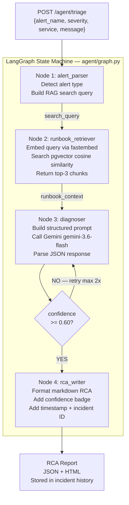
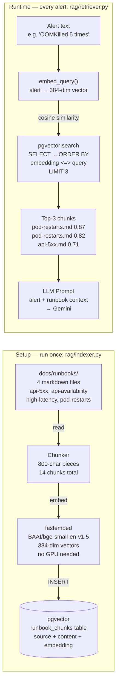
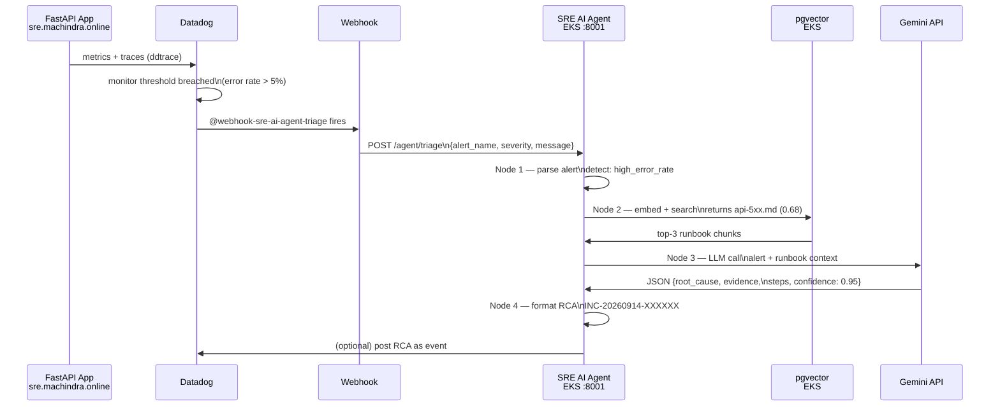
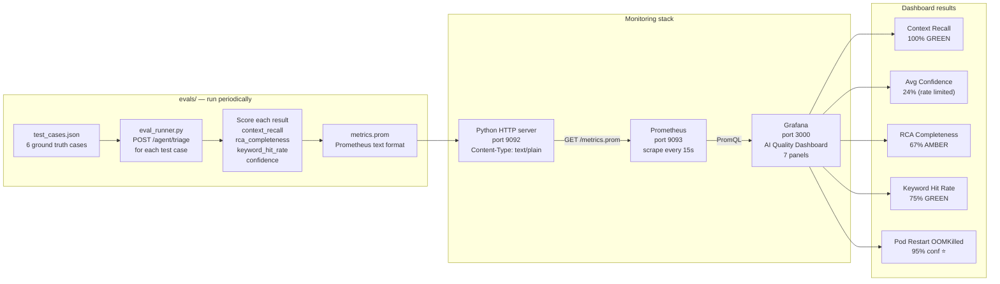
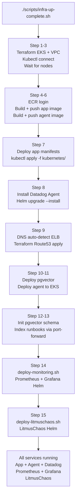
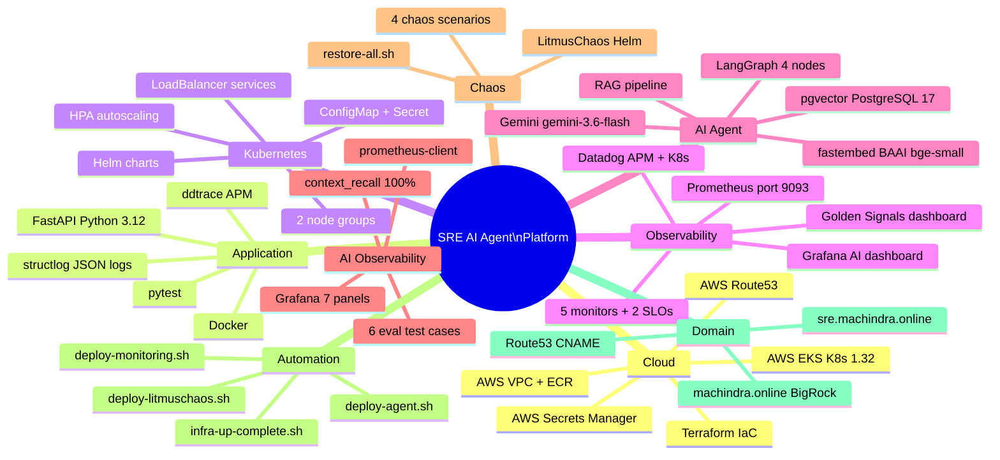
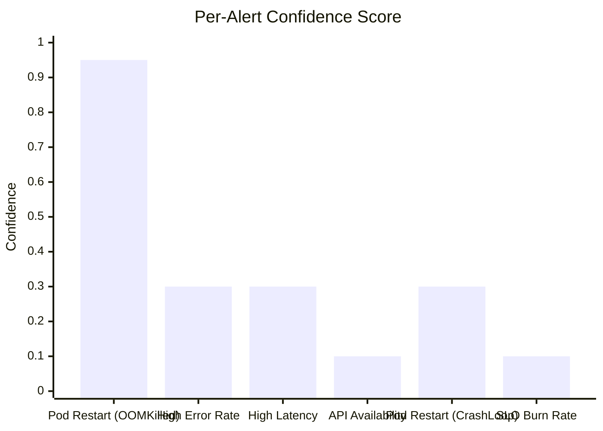

# SRE AI Agent Observability Platform — Complete Architecture

> **Repos:**
> - Phase 1-18: [Machindra220/sre-observability-eks-datadog](https://github.com/Machindra220/sre-observability-eks-datadog)
> - Phase 19-22: [Machindra220/SRE-AI-Agent-Observability](https://github.com/Machindra220/SRE-AI-Agent-Observability)
>
> **Domain:** sre.machindra.online
> **Stack:** LangGraph · fastembed · pgvector · Gemini · Datadog · Prometheus · Grafana · EKS · Terraform

---

## 1. Complete Project Journey — Phase 1 to 22

---

## 2. AWS Infrastructure Architecture

---

## 3. LangGraph Agent Pipeline

---

## 4. RAG Pipeline

---

## 5. Datadog Webhook — End-to-End Flow (Phase 21)

---

## 6. AI Observability Pipeline (Phase 20)

---

## 7. Automation Scripts — One Command Deploy (Phase 22)

---

## 8. Complete Technology Stack

---

## 9. Eval Results Summary

---

## 10. Key Numbers

| Metric | Value |
|---|---|
| Total phases | 22 |
| GitHub repos | 2 |
| Medium articles | 16 |
| EKS node groups | 2 (app_nodes + agent_nodes) |
| LangGraph nodes | 4 (parse → retrieve → diagnose → write) |
| Runbook chunks in pgvector | 14 |
| Eval test cases | 6 |
| Best confidence score | **95%** (Pod Restart OOMKilled) |
| Context recall | **100%** (RAG finds right runbook every time) |
| Datadog monitors | 5 |
| Datadog SLOs | 2 |
| Grafana dashboard panels | 7 |
| Automation scripts | 5 |

---

*GitHub: [Machindra220/SRE-AI-Agent-Observability](https://github.com/Machindra220/SRE-AI-Agent-Observability)*
*Domain: [sre.machindra.online](http://sre.machindra.online)*
