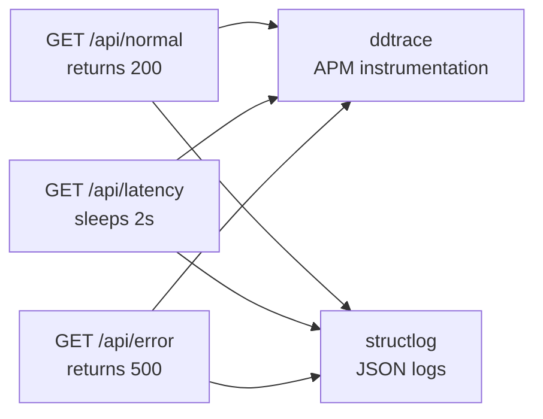
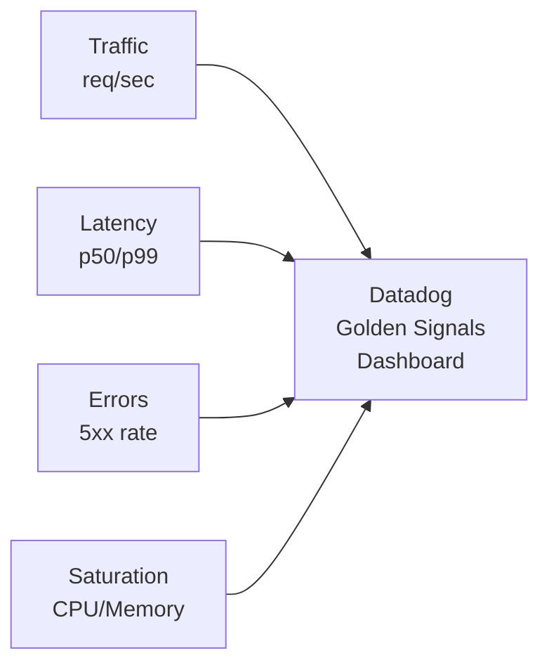
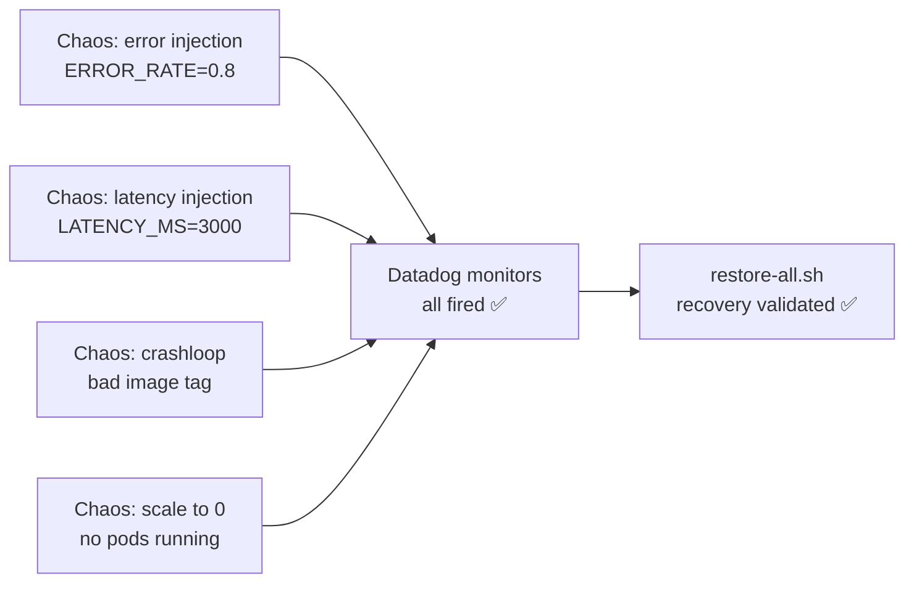
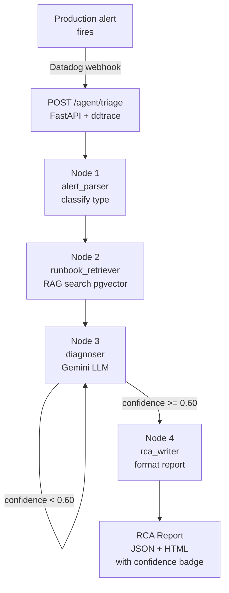
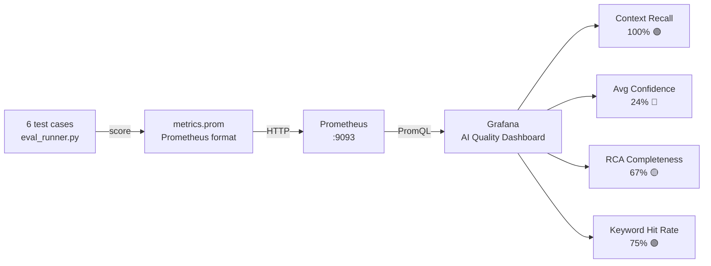
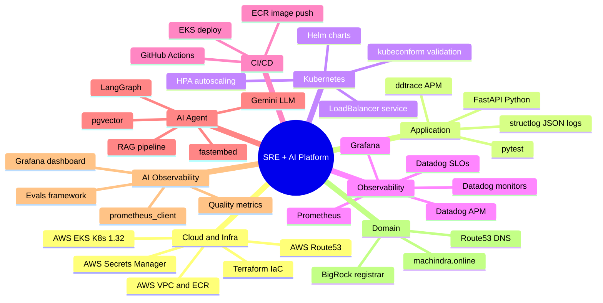

# Complete Project Overview — Phase 1 to Phase 20

> **Author:** Machindra (10 years SRE/Cloud Operations experience)
> **Repos:**
>   - Phase 1-18: Machindra220/sre-observability-eks-datadog
>   - Phase 19-20: Machindra220/SRE-AI-Agent-Observability
> **Goal:** Build a complete SRE + AIOps platform from scratch

---

## The Full Journey

```mermaid
flowchart TD
    subgraph Foundation - Phases 1 to 6
        P1["Phase 1\nFastAPI App\nddtrace + structlog"]
        P2["Phase 2\nAWS Infra\nTerraform EKS + VPC"]
        P3["Phase 3\nK8s Deploy\nManifests + HPA"]
        P4["Phase 4\nCI/CD\nGitHub Actions"]
        P5["Phase 5\nDatadog Agent\nHelm on EKS"]
        P6["Phase 6\nK8s Monitoring\nDatadog Explorer"]
        P1 --> P2 --> P3 --> P4 --> P5 --> P6
    end

    subgraph Observability - Phases 7 to 12
        P7["Phase 7\nDatadog APM\nFlame graphs"]
        P8["Phase 8\nLog-Trace\nCorrelation"]
        P9["Phase 9\nGolden Signals\nDashboard"]
        P10["Phase 10\nSLOs\nAvailability + Latency"]
        P11["Phase 11\nMonitors\n5 custom alerts"]
        P12["Phase 12\nIncident Workflow\nAutomatic SEV-1"]
        P7 --> P8 --> P9 --> P10 --> P11 --> P12
    end

    subgraph Chaos and IaC - Phases 13 to 16
        P13["Phase 13\nChaos Engineering\n4 scenarios"]
        P14["Phase 14\nIncident Investigation\nRCA methodology"]
        P15["Phase 15\nDatadog as Code\nTerraform monitors"]
        P16["Phase 16\nPlatform Summary\n16 Medium articles"]
        P13 --> P14 --> P15 --> P16
    end

    subgraph Domain and DNS - Phases 17 to 18
        P17["Phase 17\nCustom Domain\nmachindra.online"]
        P18["Phase 18\nDNS as Code\nTerraform Route53"]
        P17 --> P18
    end

    subgraph AI Agent - Phases 19 to 20
        P19["Phase 19\nLangGraph SRE Agent\nRAG + Gemini + pgvector"]
        P20["Phase 20\nAI Observability\nEvals + Prometheus + Grafana"]
        P19 --> P20
    end

    Foundation --> Observability --> Chaos and IaC --> Domain and DNS --> AI Agent
```

---

## Phase-by-Phase Summary

### Phase 1 — FastAPI Application

**Repo:** sre-observability-eks-datadog
**What:** Built a FastAPI app with 3 endpoints — normal, latency simulation, error simulation.
**Stack:** FastAPI, ddtrace (APM), structlog (JSON logging), pytest
**Key fix:** Python 3.12 required — ddtrace incompatible with Python 3.14



---

### Phase 2 — AWS Infrastructure with Terraform

**What:** Provisioned complete AWS infrastructure using Terraform.
**Resources:** VPC, EKS cluster (K8s 1.32, t3.small), ECR repo, IAM roles
**Key fixes:**
- AdministratorAccess needed for terraform user
- Disabled KMS encryption config to avoid key access issues
- `map_public_ip_on_launch = true` required in VPC config

---

### Phase 3 — Deploy to Kubernetes

**What:** Deployed FastAPI app to EKS using Kubernetes manifests.
**Resources:** Namespace, Deployment, LoadBalancer Service, ConfigMap, HPA
**Tool:** kubeconform for offline manifest validation

---

### Phase 4 — CI/CD with GitHub Actions

**What:** Automated build → push ECR → deploy to EKS pipeline.
**Key decision:** OIDC abandoned (sub claim mismatch in IAM trust policy) → used access key secrets
**Features:** Path filters on `app/**`, `kubernetes/**`, `.github/workflows/**`

---

### Phase 5 — Datadog Agent on EKS

**What:** Deployed Datadog agent via Helm with custom values.yaml.
**Features:** Container log collection, APM trace collection, Kubernetes state metrics, process monitoring
**Key fix:** Incorrect `datadog.env` value format caused range iteration error in Helm

---

### Phase 6 — Kubernetes Monitoring

**What:** Enabled Kubernetes monitoring in Datadog.
**Result:** Kubernetes Explorer showing cluster healthy — 1 node, 9 pods, 5 deployments

---

### Phase 7 — Datadog APM

**What:** Enabled distributed tracing with flame graphs.
**Key fix:** Use `dd.trace_id` (dot notation) not `dd_trace_id` (underscore) for log correlation

---

### Phase 8 — Log-Trace Correlation

**What:** Connected structured logs to APM traces.
**Result:** Every log line links to its parent trace in Datadog — click log → see full trace

---

### Phase 9 — Golden Signals Dashboard

**What:** Built Datadog dashboard showing all 4 Golden Signals.
**Metrics used:** `trace.fastapi.request` for traffic, latency, errors, saturation



---

### Phase 10 — SLOs

**What:** Created Service Level Objectives in Datadog.
**SLOs:**
- Availability: 99% target → 100% status ✅
- Latency p99 < 2s: 90% target → 92.8% status ✅

---

### Phase 11 — Custom Monitors

**What:** Created 5 production monitors in Datadog.
**Monitors:**
- P1: API Availability — No Traffic
- P2: High Error Rate (> 5%)
- P2: Pod Restart Rate (> 3 in 5 min)
- P2: SLO Burn Rate (error budget burning fast)
- P3: High p99 Latency (> 2s)

---

### Phase 12 — Incident Workflow Automation

**What:** Automated incident creation when P1 monitor fires.
**Flow:** Monitor fires → Datadog workflow → Create SEV-1 incident → Runbooks attached
**Verified with:** IR-1 and IR-2 test incidents

---

### Phase 13 — Chaos Engineering

**What:** Injected 4 chaos scenarios and validated recovery.
**Scenarios:** High error rate, high latency, pod crashloop, availability drop
**All monitors fired correctly**



**Key fixes:**
- `/api/` prefix needed on all endpoints
- ddtrace silently ignores bad `DD_TRACE_AGENT_URL` — use kubectl patch instead
- Double-else bash bug in restore-all.sh

---

### Phase 14 — Incident Investigation

**What:** Medium article documenting RCA methodology from Phase 13 scenarios.
**No new infra** — pure documentation and knowledge sharing

---

### Phase 15 — Datadog as Code

**What:** Recreated all Datadog resources with Terraform.
**Files:** monitors.tf, slos.tf, dashboard.tf, providers.tf, variables.tf, outputs.tf
**Result:** 5 monitors, 2 SLOs, 1 dashboard created via `terraform apply`

**Key fixes:**
- APP key missing API scope → 401 on monitor creation
- `burn_rate()` query not supported on free plan → replaced with error rate %
- Tags restricted to `team:` only by org policy

---

### Phase 16 — Platform Summary

**What:** Complete Medium article series — all 16 phases documented.
**Published:** 16 articles in docs/medium/

---

### Phase 17 — Custom Domain

**What:** Configured custom domain for the SRE platform.
**Domain:** machindra.online (BigRock registrar)
**DNS:** CNAME `sre.machindra.online` → EKS LoadBalancer
**Key fix:** WSL2 DNS fix — unlink resolv.conf, use 8.8.8.8

---

### Phase 18 — DNS as Code

**What:** Imported existing Route 53 resources into Terraform state.
**Resources imported:** aws_route53_zone.main, aws_route53_record.sre_cname
**Key learning:** Losing tfstate means re-import — S3 backend recommended for production

---

### Phase 19 — LangGraph SRE Agent

**Repo:** SRE-AI-Agent-Observability
**What:** Built an AI-powered SRE agent that automatically triages production alerts.



**Stack:**
- LangGraph (4-node state machine)
- fastembed BAAI/bge-small-en-v1.5 (384-dim local embeddings)
- pgvector (PostgreSQL vector extension, Docker)
- Gemini gemini-3.6-flash (LLM)
- FastAPI + ddtrace (API + APM)

**Results:**
- Pod Restart (OOMKilled) → 95% confidence ⭐
- All 4 alert types → correct runbook retrieved ✅
- HTML RCA reports with green/amber/red confidence badges

**Key bugs fixed:**
- `chunk_text()` infinite loop (advance <= 0 guard)
- Gemini model names change — use `genai.list_models()`
- Python 3.14 breaks psycopg2 — always use Python 3.12

---

### Phase 20 — AI Observability

**What:** Automated quality monitoring for the AI agent.



**Key issues fixed:**
- Gemini rate limiting (429) → sleep(6) between calls
- Python http.server wrong Content-Type → custom server with text/plain
- Port conflicts (9090, 9091, 3000) → used 9092, 9093
- Grafana bar labels truncated → Rename fields by regex transformation

---

## Complete Technology Stack



---

## Skills Demonstrated Across All 20 Phases

| JD Requirement | Phase(s) | How demonstrated |
|---|---|---|
| Cloud — AWS | 2, 3, 4, 17, 18 | EKS, ECR, VPC, IAM, Route53, Secrets Manager |
| Kubernetes | 3, 5, 6, 13 | Deploy, HPA, Helm, chaos testing |
| Observability — Datadog | 5-12, 15 | APM, monitors, SLOs, dashboards, IaC |
| Observability — Prometheus/Grafana | 20 | AI quality metrics dashboard |
| Automation — Bash | 2, 13 | infra-up/down.sh, restore-all.sh |
| Automation — Python | 19, 20 | LangGraph agent, eval runner |
| CI/CD | 4 | GitHub Actions pipeline |
| SRE Core — SLOs/SLIs | 10, 11, 12 | SLOs created, monitors configured |
| SRE Core — Incident handling | 12, 13, 14 | Workflow automation, chaos, RCA |
| AI and Agentic Systems | 19 | LangGraph, RAG, LLM, pgvector |
| LLM evals / AI observability | 20 | Eval framework, Prometheus metrics, Grafana |
| Vector Database | 19 | pgvector with fastembed embeddings |
| Practical AI — real agentic workflow | 19 | Full working agent, 95% confidence ⭐ |

---

## Project Stats

| Metric | Value |
|---|---|
| Total phases | 20 |
| Repos | 2 |
| Medium articles | 16 |
| AWS resources | VPC, EKS, ECR, Route53, Secrets Manager |
| Datadog resources | 5 monitors, 2 SLOs, 2 dashboards |
| Terraform files | 20+ |
| Runbooks | 4 |
| Agent nodes | 4 (LangGraph) |
| Runbook chunks in pgvector | 19 |
| Eval test cases | 6 |
| Best confidence score | 95% (Pod Restart OOMKilled) |
| Context recall | 100% |

---

*Built by Machindra — SRE/Cloud Operations Engineer with 10 years experience*
*GitHub: Machindra220*
*Domain: machindra.online*