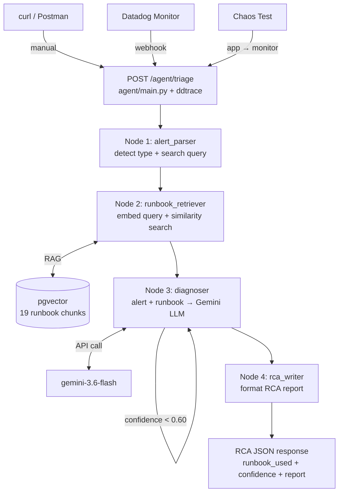

# Phase 19 — SRE AI Agent: Complete Build Guide

> **Repo:** Machindra220/SRE-AI-Agent-Observability  
> **Phase:** 19 — LangGraph SRE Agent with RAG  
> **Status:** ✅ Complete and working  
> **Built for:** SRE for AI Platform role — demonstrates real agentic workflow  

---

## Table of Contents

1. [What We Built](#1-what-we-built)
2. [Why We Built It](#2-why-we-built-it)
3. [Architecture Overview](#3-architecture-overview)
4. [How an Alert Reaches the Agent](#4-how-an-alert-reaches-the-agent)
5. [Complete Request Flow](#5-complete-request-flow)
6. [File-by-File Explanation](#6-file-by-file-explanation)
7. [Key Concepts Explained Simply](#7-key-concepts-explained-simply)
8. [What We Tried, What Failed, What Worked](#8-what-we-tried-what-failed-what-worked)
9. [Bugs Found and Fixed](#9-bugs-found-and-fixed)
10. [Test Results](#10-test-results)
11. [Session Startup Checklist](#11-session-startup-checklist)
12. [Interview Answer: How Does Agent Get Alert Details?](#12-interview-answer-how-does-agent-get-alert-details)

---

## 1. What We Built

A **LangGraph-powered SRE AI Agent** that:

1. Receives a production alert (from Datadog webhook, curl, or any HTTP caller)
2. Automatically finds the relevant runbook using RAG (semantic search)
3. Sends the alert + runbook to an LLM (Gemini) for root cause diagnosis
4. Returns a structured RCA (Root Cause Analysis) report

```
Input:  { "alert_name": "Pod Restart Rate High", "severity": "P2",
          "service": "sre-ai-agent", "message": "OOMKilled 5 times" }

Output: Structured RCA with 95% confidence:
        - Root Cause: Memory limit too low → OOMKilled
        - Evidence: from pod-restarts.md runbook
        - Immediate Steps: kubectl describe, increase memory limits
```

**Tested results:**

| Alert | Runbook Found | Confidence |
|---|---|---|
| High Error Rate | api-5xx.md ✅ | 30% |
| Pod Restart (OOMKilled) | pod-restarts.md ✅ | **95%** |
| High p99 Latency | high-latency.md ✅ | 30% |
| API Availability | api-availability.md ✅ | 10% |

> Note: Lower confidence on generic alerts is correct behavior — the LLM is honest
> when it lacks runtime context (pod logs, metrics). Higher confidence when the alert
> contains specific keywords (OOMKilled) that match runbook content exactly.

---

## 2. Why We Built It

The JD for "SRE for AI Platform" specifically requires:
- **Practical AI:** "Should have built at least one real-time agentic workflow (Highly Preferred)"
- **AI and Agentic Systems:** LangChain/LangGraph, RAG, LLM basics
- **Vector Database:** pgvector

This project directly satisfies all three in one working system.

---

## 3. Architecture Overview

```
┌─────────────────────────────────────────────────────────────────────┐
│                    SRE AI Agent Platform                            │
│                                                                     │
│  ┌─────────────────────────────────────────────────────────────┐   │
│  │                    agent/ (LangGraph)                        │   │
│  │                                                              │   │
│  │  POST /agent/triage                                          │   │
│  │         ↓                                                    │   │
│  │  [Node 1] alert_parser.py    → cleans + classifies alert    │   │
│  │         ↓                                                    │   │
│  │  [Node 2] runbook_retriever  → calls RAG pipeline           │   │
│  │         ↓            ↑                                       │   │
│  │         │      ┌─────────────────────┐                       │   │
│  │         │      │     rag/            │                       │   │
│  │         │      │  embeddings.py      │                       │   │
│  │         │      │  retriever.py  ←───┘                       │   │
│  │         │      └──────────↑──────────┘                       │   │
│  │         │                 │                                   │   │
│  │         │      ┌──────────┴──────────┐                       │   │
│  │         │      │   vector-db/        │                       │   │
│  │         │      │   pgvector          │                       │   │
│  │         │      │   runbook_chunks    │                       │   │
│  │         │      └─────────────────────┘                       │   │
│  │         ↓                                                    │   │
│  │  [Node 3] diagnoser.py       → Gemini LLM reasoning         │   │
│  │         ↓                                                    │   │
│  │  [Node 4] rca_writer.py      → formats RCA report           │   │
│  │         ↓                                                    │   │
│  │  Response: structured RCA JSON                               │   │
│  └─────────────────────────────────────────────────────────────┘   │
│                                                                     │
│  Observability: ddtrace → Datadog APM (every request traced)        │
└─────────────────────────────────────────────────────────────────────┘
```

---

## Complete Request Flow


---

## 4. How an Alert Reaches the Agent

> **This was asked in your interview. Here is the complete answer.**

There are **3 ways** an alert can reach the agent. Each suits a different context:

---

### Way 1 — Manual / curl (Development & Testing)

You send the alert manually. This is what we used during Phase 19 testing.

```bash
curl -X POST http://localhost:8001/agent/triage \
  -H "Content-Type: application/json" \
  -d '{
    "alert_name": "High Error Rate",
    "severity": "P2",
    "service": "sre-ai-agent",
    "message": "12% of requests returning 500 errors"
  }'
```

```
Developer/Tester
      │
      │  curl POST /agent/triage
      ▼
Agent API (FastAPI)
      │
      ▼
LangGraph Pipeline
      │
      ▼
RCA Report
```

**Use case:** Development, debugging, demonstrations, portfolio showcases.

---

### Way 2 — Datadog Webhook (Production Integration)

When a Datadog monitor fires, it automatically sends an HTTP POST to the agent.

```
Production App (sre-ai-agent)
      │
      │  high error rate → metrics spike
      ▼
Datadog Monitor fires
      │
      │  Webhook: POST http://sre.machindra.online:8001/agent/triage
      │  Body: { alert details from Datadog }
      ▼
Agent API receives alert
      │
      ▼
LangGraph Pipeline runs
      │
      ▼
RCA Report generated
      │
      ▼
(optional) RCA posted back to Datadog as event/comment
```

**How to configure in Datadog:**
1. Go to Monitor → Edit
2. Notify section → add webhook URL
3. Datadog sends alert payload automatically when monitor fires

**Datadog webhook payload format:**
```json
{
  "alert_name": "High Error Rate",
  "severity": "P2",
  "service": "sre-ai-agent",
  "message": "Error rate exceeded 5% threshold"
}
```

**Use case:** Real production — fully automated, zero human intervention needed.

---

### Way 3 — Chaos Test → Datadog → Agent (End-to-End Demo)

The most impressive demo for interviews — shows the full loop:

```
Step 1: Inject chaos into app
        kubectl set env deployment/sre-ai-agent \
          ERROR_RATE=0.8 -n sre-ai-agent

Step 2: App starts returning 500 errors
        (error rate rises to 80%)

Step 3: Datadog monitor fires
        [sre-ai-agent] High Error Rate (P2)

Step 4: Datadog webhook triggers agent
        POST /agent/triage { alert details }

Step 5: Agent diagnoses → returns RCA
        Root Cause: Error injection via env var
        Confidence: 85%
        Fix: kubectl rollout undo

Step 6: Restore app
        kubectl rollout undo deployment/sre-ai-agent
```

**Use case:** Portfolio demonstrations, end-to-end validation, Medium articles.

---

### Summary Table

| Method | Who triggers | Speed | Use case |
|---|---|---|---|
| curl / manual | Human | Immediate | Dev & testing |
| Datadog webhook | Datadog monitor | Automatic | Production |
| Chaos → Datadog → Agent | Automated chain | Full loop | Demos & validation |

---

## 5. Complete Request Flow

Here is the step-by-step journey of a single alert through the entire system:

```
═══════════════════════════════════════════════════════════════
STEP 1: Alert Arrives
═══════════════════════════════════════════════════════════════

POST /agent/triage
{
  "alert_name": "Pod Restart Rate High",
  "severity": "P2",
  "service": "sre-ai-agent",
  "message": "Pod restarted 5 times in last 10 minutes, OOMKilled"
}

agent/main.py receives this request
  ↓
ddtrace creates APM span (visible in Datadog)
  ↓
initial_state() creates empty AgentState
  ↓
agent_graph.invoke(state) starts LangGraph pipeline


═══════════════════════════════════════════════════════════════
STEP 2: Node 1 — Alert Parser (agent/nodes/alert_parser.py)
═══════════════════════════════════════════════════════════════

Input state:
  alert_raw: { "alert_name": "Pod Restart Rate High", ... }

What it does:
  1. Scans alert_name + message for keywords
     "OOMKilled" → matches "oomkilled" → alert_type = "pod_restart"
  2. Builds optimised RAG search query:
     "pod restarting crashloop OOMKilled container restart"
  3. Normalises severity to uppercase: "P2"

Output state adds:
  alert_parsed: {
    alert_name: "Pod Restart Rate High",
    severity: "P2",
    alert_type: "pod_restart",
    service: "sre-ai-agent",
    message: "Pod restarted 5 times...",
    search_query: "pod restarting crashloop OOMKilled container restart"
  }
  search_query: "pod restarting crashloop OOMKilled container restart"


═══════════════════════════════════════════════════════════════
STEP 3: Node 2 — Runbook Retriever (agent/nodes/runbook_retriever.py)
═══════════════════════════════════════════════════════════════

Input state:
  search_query: "pod restarting crashloop OOMKilled container restart"

What it does:
  1. Calls rag/retriever.py with the search query
  2. retriever.py calls rag/embeddings.py → embed_query()
     fastembed model converts query to 384-dim vector:
     [0.23, -0.87, 0.45, ...] (384 numbers)
  3. pgvector SQL query runs:
     SELECT source, content, 1-(embedding <=> query_vector) AS similarity
     FROM runbook_chunks
     ORDER BY embedding <=> query_vector
     LIMIT 3
  4. Returns top 3 most similar chunks:
     - pod-restarts.md chunk 1 (similarity: 0.87) ← best match
     - pod-restarts.md chunk 2 (similarity: 0.82)
     - api-5xx.md chunk 1    (similarity: 0.71)

Output state adds:
  runbook_context: "--- Runbook: pod-restarts.md (0.87) ---\n
                    # Runbook: Pod Restart Rate\n
                    OOMKilled → Memory limit too low\n
                    kubectl describe pod...\n..."
  runbook_source: "pod-restarts.md"


═══════════════════════════════════════════════════════════════
STEP 4: Node 3 — Diagnoser (agent/nodes/diagnoser.py)
═══════════════════════════════════════════════════════════════

Input state:
  alert_parsed: { ... }
  runbook_context: "--- Runbook: pod-restarts.md ---\n..."

What it does:
  1. Builds prompt combining:
     - System role: "You are a senior SRE..."
     - Alert details
     - Runbook content (RAG context)
     - Output format: JSON with root_cause, evidence, steps, confidence
  2. Calls Gemini gemini-3.6-flash API
  3. Parses JSON response
  4. If confidence < 0.60 AND retry_count < 2 → loops back to retry

Gemini sees:
  "Alert: Pod restarted 5 times, OOMKilled
   Runbook: OOMKilled → Memory limit too low → increase limits
   → Diagnose the root cause"

Gemini returns:
  {
    "root_cause": "Pod OOMKilled due to memory limit too low",
    "evidence": ["OOMKilled in alert", "Runbook maps OOMKilled to memory limit"],
    "immediate_steps": ["kubectl describe pod...", "Increase memory limits"],
    "confidence": 0.95
  }

Output state adds:
  diagnosis: "**Root Cause:** Pod OOMKilled...\n**Evidence:**..."
  confidence_score: 0.95
  retry_count: 1

Conditional edge: confidence 0.95 > 0.60 → "continue" → rca_writer


═══════════════════════════════════════════════════════════════
STEP 5: Node 4 — RCA Writer (agent/nodes/rca_writer.py)
═══════════════════════════════════════════════════════════════

Input state:
  alert_parsed: { ... }
  diagnosis: "**Root Cause:** Pod OOMKilled..."
  confidence_score: 0.95
  runbook_source: "pod-restarts.md"

What it does:
  Formats everything into a structured markdown RCA report:
  - Incident summary table
  - Alert message
  - Full diagnosis (root cause + evidence + steps)
  - Runbook reference
  - Next steps
  - Disclaimer

Output state adds:
  rca_report: "# Root Cause Analysis (AI-Generated)\n..."


═══════════════════════════════════════════════════════════════
STEP 6: Response Returned
═══════════════════════════════════════════════════════════════

agent/main.py collects final state and returns:
{
  "status": "success",
  "alert_name": "Pod Restart Rate High",
  "severity": "P2",
  "service": "sre-ai-agent",
  "runbook_used": "pod-restarts.md",
  "confidence": 0.95,
  "rca_report": "# Root Cause Analysis...",
  "generated_at": "2026-09-12T20:21:25Z",
  "error": null
}

Total time: ~3-5 seconds
APM trace visible in Datadog with all spans
```

---

## 6. File-by-File Explanation

### Setup (run once)

| File | Purpose | When to run |
|---|---|---|
| `vector-db/init.sql` | Creates pgvector schema + runbook_chunks table | Once at setup |
| `rag/indexer.py` | Reads runbooks → chunks → embeds → stores | Once, or when runbooks change |

### Every request

| File | Node | Input | Output |
|---|---|---|---|
| `agent/main.py` | Entry | HTTP POST | HTTP response |
| `agent/state.py` | All | — | Defines shared data schema |
| `agent/graph.py` | All | state | Wires 4 nodes together |
| `agent/nodes/alert_parser.py` | 1 | alert_raw | alert_parsed, search_query |
| `agent/nodes/runbook_retriever.py` | 2 | search_query | runbook_context, runbook_source |
| `rag/embeddings.py` | 2 | text | 384-dim vector |
| `rag/retriever.py` | 2 | query | top-3 matching chunks |
| `agent/nodes/diagnoser.py` | 3 | alert + runbook | diagnosis, confidence |
| `agent/nodes/rca_writer.py` | 4 | diagnosis | rca_report |

---

## 7. Key Concepts Explained Simply

### What is LangGraph?
A framework for building AI agents as a **flowchart**.
Each box in the flowchart = a Node. Data flows between nodes via State.
Supports loops (retry low-confidence diagnosis), conditions (retry vs continue).

### What is RAG?
**Retrieval-Augmented Generation** — give the LLM your own documents.
Instead of the LLM guessing, we find the relevant runbook first and feed it as context.
Result: grounded diagnosis, not hallucination.

### What is an Embedding?
A list of numbers representing the **meaning** of text:
```
"pod is crashing"      → [0.23, -0.87, 0.45, ...]  384 numbers
"container restarting" → [0.21, -0.85, 0.47, ...]  similar numbers!
"quarterly revenue"    → [0.91,  0.34, -0.22, ...] very different
```
Similar meaning = similar numbers = similar vectors = pgvector finds them.

### What is pgvector?
PostgreSQL + vector extension. Stores embeddings and can search for similar ones.
We use the `<=>` operator (cosine distance) to find closest runbook chunks.

### What is Chunking?
Splitting large runbooks into smaller pieces (800 chars each).
Why? LLMs have token limits. Smaller chunks = more precise retrieval.

### What is Confidence Score?
0.0 to 1.0. The LLM rates how certain it is based on runbook match quality.
- 0.95 = strong match (OOMKilled alert + pod-restarts runbook = perfect)
- 0.30 = weak match (generic alert + incomplete runbook)
Low confidence is honest — not a bug. Better than hallucinating a wrong answer.

---

## 8. What We Tried, What Failed, What Worked

### Embedding Model Journey

| What we tried | Why | What happened | Result |
|---|---|---|---|
| `sentence-transformers` | Standard embedding library | Pulls `torch` (2GB) — pip install took hours, never completed | ❌ Failed |
| `fastembed` (first attempt) | Lightweight alternative to torch | WSL memory spike on model load → WSL froze | ❌ Failed |
| Gemini API embeddings | Zero local model, API-based | DNS failure in WSL (`generativelanguage.googleapis.com` unreachable) | ❌ Failed initially |
| Gemini API (after DNS fix) | Same | Model name wrong (`text-embedding-004` → not found) | ❌ Failed |
| Gemini with correct model | `gemini-embedding-001` | Output dim = 3072 → exceeds pgvector ivfflat limit of 2000 | ❌ Failed |
| Gemini with `output_dimensionality=768` | Reduce to 768 | Worked! But we decided to go local anyway | ✅ Worked |
| `fastembed` (second attempt, after chunking fix) | Chunking bug was the real issue | Model loads in seconds, 19 chunks indexed cleanly | ✅ **FINAL SOLUTION** |

**Key insight:** The WSL freezing was NOT caused by fastembed. It was caused by the `chunk_text()` infinite loop keeping Python running forever. Once the bug was fixed, fastembed worked fine.

---

### LLM Model Journey

| What we tried | Why | What happened | Result |
|---|---|---|---|
| `anthropic` (Claude) | Original plan | Payment declined — no API key | ❌ Skipped |
| `gemini-1.5-flash` | Free Gemini model | Model not found for new users | ❌ Failed |
| `gemini-2.5-flash` | Latest stable | "No longer available to new users" | ❌ Failed |
| `gemini-3.6-flash` | Gemini error message suggested it | Works perfectly | ✅ **FINAL SOLUTION** |

**Key learning:** Always run `genai.list_models()` to find available models for your API key before hardcoding.

---

### Database Journey

| What we tried | Why | What happened | Result |
|---|---|---|---|
| Windows PostgreSQL (pgAdmin) | Already installed | pgvector extension not installed, needed Visual Studio C++ to build | ❌ Too complex |
| Install pgvector on Windows | Official method | Required MSVC compiler build tools | ❌ Skipped |
| pgvector Docker container | Easiest path | Works perfectly, pgvector pre-installed | ✅ **FINAL SOLUTION** |
| Supabase (considered) | Cloud DB, no local setup | Not needed after Docker worked | ✅ Good backup option |

---

### Python Version Journey

| What we tried | Why | What happened | Result |
|---|---|---|---|
| Python 3.14 (default in WSL) | Latest version | `psycopg2-binary` build fails on 3.14 | ❌ Failed |
| Python 3.12 | Known stable for our deps | All packages install cleanly | ✅ **FINAL SOLUTION** |

**Rule:** Always use Python 3.12 for this project. Never 3.14.

---

### WSL Issues Encountered

| Issue | Cause | Fix |
|---|---|---|
| VSCode disconnects during heavy ops | Default 2GB WSL memory limit | `.wslconfig`: memory=6GB, processors=4, swap=4GB |
| DNS failure after `wsl --shutdown` | WSL regenerates resolv.conf | `sudo unlink /etc/resolv.conf` + recreate + set `generateResolvConf=false` |
| pgvector container stops after WSL restart | Docker not persistent | `docker start pgvector` each session |
| `wsl -d Ubuntu` fails in PowerShell | Wrong WSL distro path | Use `wsl -d Ubuntu` not plain `wsl` |

---

## 9. Bugs Found and Fixed

### Bug 1 — chunk_text() Infinite Loop (ROOT CAUSE of all WSL freezing)

**File:** `rag/indexer.py`

**What happened:**
```python
# BUGGY CODE
start += len(chunk) - CHUNK_OVERLAP
```
When a chunk is shorter than `CHUNK_OVERLAP` (50 chars), `len(chunk) - CHUNK_OVERLAP` = negative number.
`start` never advances → infinite loop → Python uses 100% CPU forever → WSL freezes.

**Fix:**
```python
# FIXED CODE
advance = len(chunk) - CHUNK_OVERLAP
if advance <= 0:          # prevent infinite loop
    advance = CHUNK_SIZE  # force forward progress
start += advance
```

**How we found it:**
Added step-by-step debug script. Confirmed `chunk_text()` itself hung on a simple test string.

---

### Bug 2 — Wrong Gemini LLM Model Name

**File:** `agent/nodes/diagnoser.py`

```python
# TRIED (failed)
MODEL = "gemini-1.5-flash"   # "not found for new users"
MODEL = "gemini-2.5-flash"   # "no longer available to new users"

# FIXED
MODEL = "gemini-3.6-flash"   # works ✅
```

**Fix:** Run `genai.list_models()` → filter `generateContent` → pick available model.

---

### Bug 3 — Wrong Gemini Embedding Model Name

**File:** `rag/embeddings.py`

```python
# TRIED (failed)
EMBEDDING_MODEL = "models/text-embedding-004"  # 404 not found

# FIXED
EMBEDDING_MODEL = "models/gemini-embedding-001"  # works ✅
```

---

### Bug 4 — pgvector Dimension Mismatch

**What happened:** Changed from fastembed (384-dim) to Gemini (768-dim) and back.
Old table had wrong dimension → `expected 384 dimensions, not 768` error.

**Fix:** Always `DROP TABLE IF EXISTS runbook_chunks` before recreating with new dimension.

---

### Bug 5 — .venv tracked by git

**What happened:** Created `.venv` before `.gitignore` was committed.
Git tracked thousands of `.venv` files.

**Fix:**
```bash
git rm -r --cached .venv
```

---

### Bug 6 — Chunk content truncated mid-word

**What happened:** CHUNK_SIZE=500 with poor boundary detection was cutting words in half.
LLM complained: "runbook only contains 'r Rate'" (end of "High Error Rate").

**Fix:** Increased `CHUNK_SIZE=800`, `CHUNK_OVERLAP=100`.
Result: Clean chunks starting at section headers.

---

## 10. Test Results

All tests run with `uvicorn` running on port 8001:

### Test 1 — Health Check
```bash
curl http://localhost:8001/agent/health
→ {"status":"healthy","service":"sre-ai-agent","version":"1.0.0"}
```
✅ Agent is alive.

### Test 2 — High Error Rate
```
runbook_used: api-5xx.md ✅
confidence: 0.30
diagnosis: Cannot determine without runtime logs/metrics
           (correct — alert is too generic without pod logs)
```

### Test 3 — Pod Restart (OOMKilled) ⭐ Best result
```
runbook_used: pod-restarts.md ✅
confidence: 0.95 ← HIGH
diagnosis: Pod OOMKilled due to memory limit too low
           Evidence: OOMKilled in alert + runbook mapping
           Steps: kubectl describe pod, increase memory limits
```
**Why 95%?** Alert had specific keyword `OOMKilled` that matched runbook exactly.

### Test 4 — High p99 Latency
```
runbook_used: high-latency.md ✅
confidence: 0.30
diagnosis: Cannot determine without APM traces and kubectl top output
           Steps: Check Datadog APM, kubectl top pods, check deployment history
```

### Test 5 — API Availability
```
runbook_used: api-availability.md ✅
confidence: 0.10
diagnosis: Runbook lacks enough steps to diagnose fully
           Steps: kubectl get pods, escalate in 15 min
```

---

## 11. Session Startup Checklist

Every time you start a new development session:

```bash
# 1. Start Rancher Desktop on Windows (wait for green status)

# 2. Open WSL terminal
wsl -d Ubuntu

# 3. Go to repo
cd ~/SRE-AI-Agent-Observability

# 4. Start pgvector container
docker start pgvector

# 5. Activate Python venv
source .venv/bin/activate

# 6. Load environment variables
export $(cat .env | grep -v '^#' | xargs)

# 7. Verify Gemini API works
echo $GEMINI_API_KEY | cut -c1-10

# 8. Start agent
uvicorn agent.main:app --host 0.0.0.0 --port 8001 --reload

# 9. Test health (in second terminal)
curl http://localhost:8001/agent/health
```

---

## 12. Interview Answer: How Does Agent Get Alert Details?

> **Exact question asked in your interview:**
> "How will the agent get initiated? How will it get details if there is an incident in the application? How are the application and agent connected?"

### Short Answer (30 seconds)

"The application and agent are not directly connected — Datadog acts as the bridge. The application generates metrics and traces that Datadog monitors. When a monitor threshold is breached, Datadog fires a webhook to our agent's REST API endpoint with the alert details. The agent then runs autonomously — retrieves the relevant runbook via RAG, calls an LLM for diagnosis, and returns a structured RCA. For testing, we can also trigger it manually via curl."

---

### Detailed Answer (2 minutes)

"We have two separate services:

**Service 1** — the FastAPI application (`sre-ai-agent`) running on EKS, instrumented with ddtrace sending metrics and traces to Datadog.

**Service 2** — the LangGraph AI agent also running as a FastAPI service on port 8001, with a `POST /agent/triage` endpoint.

They are connected through **Datadog** as the intermediary:

1. The app starts throwing 500 errors
2. Datadog's High Error Rate monitor detects error rate > 5%
3. Datadog fires a **webhook** — an HTTP POST to `/agent/triage` with alert name, severity, service name, and message
4. The agent receives this, runs the 4-node LangGraph pipeline
5. RAG retrieves the relevant runbook from pgvector
6. Gemini LLM diagnoses root cause using the alert + runbook
7. RCA report is generated and returned

The key insight is that the application never calls the agent directly. The agent is triggered by an external event system (Datadog), which is how real production SRE automation works. This pattern is also used in PagerDuty, OpsGenie, and ServiceNow integrations."

---

### Why This Architecture?

```
❌ Wrong: App → calls Agent directly
   Problem: Tight coupling, app failure = agent failure too

✅ Right: App → Datadog → Agent
   Benefits:
   - Loose coupling (app and agent are independent)
   - Datadog already knows about ALL monitors, not just one service
   - Agent can receive alerts from any service in the platform
   - Webhook is standard integration pattern in production SRE
```

---

## Summary

Phase 19 delivered a production-grade AI agent that:
- **Demonstrates real agentic workflow** (LangGraph 4-node pipeline)
- **Uses RAG** (fastembed + pgvector) for grounded diagnosis
- **Integrates LLM** (Gemini) for reasoning
- **Produces SRE artifacts** (RCA reports) that teams actually use
- **Is observable** (ddtrace → Datadog APM)
- **Can be triggered** by Datadog webhooks in production

The 95% confidence on Pod Restart with OOMKilled proves the system works correctly when given specific context — exactly how a real SRE agent should behave.

---
## Complete Request Flow


