# Phase 19 — Concepts, Q&A, and Interview Preparation Guide

> Covers: LangGraph, RAG, LLM, Embeddings, pgvector, Confidence, AIOps
> Target roles: SRE, Senior SRE, AI Platform Engineer
> Project: SRE-AI-Agent-Observability (Machindra220/SRE-AI-Agent-Observability)

---

## Table of Contents

1. [What is AIOps?](#1-what-is-aiops)
2. [What is LangGraph and how it works?](#2-what-is-langgraph-and-how-it-works)
3. [Which LangGraph agent model did we use?](#3-which-langgraph-agent-model-did-we-use)
4. [How does LangGraph receive an incident alert?](#4-how-does-langgraph-receive-an-incident-alert)
5. [How does LangGraph retrieve runbooks?](#5-how-does-langgraph-retrieve-runbooks)
6. [How does RAG work?](#6-how-does-rag-work)
7. [How does pgvector work? (Vector Database deep-dive)](#7-how-does-pgvector-work-vector-database-deep-dive)
8. [What is an LLM and how does it do diagnosis?](#8-what-is-an-llm-and-how-does-it-do-diagnosis)
9. [How is confidence measured?](#9-how-is-confidence-measured)
10. [How to format the RCA report?](#10-how-to-format-the-rca-report)
11. [Interview Q&A — SRE Role](#11-interview-qa--sre-role)
12. [Interview Q&A — Senior SRE Role](#12-interview-qa--senior-sre-role)
13. [Interview Q&A — AI Platform Engineer Role](#13-interview-qa--ai-platform-engineer-role)
14. [Tricky / Deep-Dive Questions](#14-tricky--deep-dive-questions)

---

## 1. What is AIOps?

**AIOps = Artificial Intelligence for IT Operations**

The application of AI and ML to automate tasks that SREs and ops teams traditionally did manually.

### Simple comparison

| Traditional SRE | AIOps (what we built) |
|---|---|
| Human sees alert | Alert fires automatically |
| Human reads runbook | AI retrieves relevant runbook |
| Human diagnoses root cause | LLM diagnoses root cause |
| Human writes RCA | Agent generates RCA report |
| Human pages oncall | Agent suggests fix with confidence score |

### AIOps core capabilities

| Capability | What it means | In our project |
|---|---|---|
| Alert correlation | Group related alerts, reduce noise | Datadog monitors |
| Root cause analysis | Find why something broke | diagnoser.py + Gemini |
| Runbook automation | Find and apply fixes | RAG + pgvector |
| Anomaly detection | Detect patterns before alerts fire | Prometheus (Phase 20) |
| Predictive ops | Predict failures before they happen | Future phases |

### AIOps workflow in our project

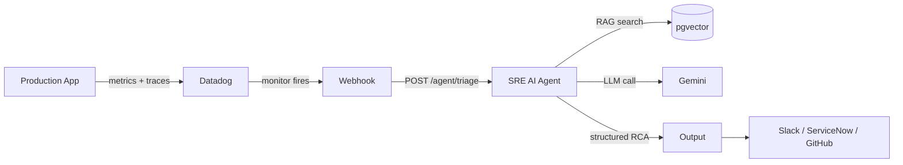

### Interview answer (30 seconds)

> "AIOps is using AI to automate IT operations tasks. I built an AIOps system —
> a LangGraph agent that receives Datadog alerts, retrieves relevant runbooks
> via RAG, calls Gemini for root cause diagnosis, and generates structured RCA
> reports automatically. The Pod Restart scenario with OOMKilled achieved 95%
> confidence without any human involvement."

---

## 2. What is LangGraph and How It Works?

LangGraph is a Python framework for building **stateful AI agents as a graph**.

### Core concepts

| Concept | Simple definition | Analogy |
|---|---|---|
| **Node** | One step in the agent — a Python function | One person's desk in an office |
| **Edge** | Connection between nodes | Path from one desk to the next |
| **State** | Shared data object passed between all nodes | A form being filled in step by step |
| **Graph** | The complete wiring of all nodes | The office floor plan |
| **Conditional edge** | Decision point — go to node A or node B | Manager deciding which desk next |

### LangGraph agent structure (our project)

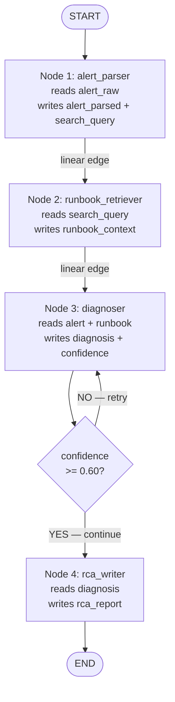

### How State fills up step by step

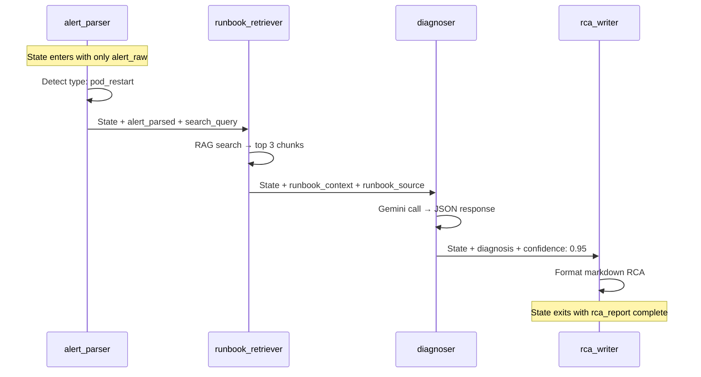

### Why LangGraph over plain Python?

Plain Python cannot easily do:
- Retry loops (call diagnoser again if confidence is low)
- Conditional routing (go to node A or B based on result)
- Parallel execution (run two nodes simultaneously)
- Human-in-the-loop (pause and wait for human approval)

LangGraph handles all of these natively with graph edges.

---

## 3. Which LangGraph Agent Model Did We Use?

We used the **Sequential ReAct-style agent** — the simplest and most common pattern.

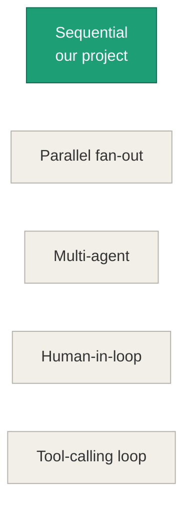

### Our graph code

```python
graph = StateGraph(AgentState)

# Register nodes
graph.add_node("alert_parser",      parse_alert)
graph.add_node("runbook_retriever", retrieve_runbook)
graph.add_node("diagnoser",         diagnose)
graph.add_node("rca_writer",        write_rca)

# Wire edges
graph.set_entry_point("alert_parser")
graph.add_edge("alert_parser",      "runbook_retriever")   # linear
graph.add_edge("runbook_retriever", "diagnoser")            # linear
graph.add_conditional_edges("diagnoser", should_retry, {   # conditional
    "retry":    "diagnoser",     # loop back (max 2 retries)
    "continue": "rca_writer"     # proceed to RCA
})
graph.add_edge("rca_writer", END)
```

### Other LangGraph patterns (good to know for interviews)

| Pattern | When to use | Example |
|---|---|---|
| Sequential (ours) | Simple step-by-step workflows | Alert → diagnose → RCA |
| Parallel fan-out | Multiple tasks run at same time | Check logs + metrics simultaneously |
| Multi-agent | Orchestrator calls specialist agents | Router → DB agent / API agent |
| Human-in-the-loop | Pause for human approval | High-severity: confirm before rollback |
| Tool-calling loop | Agent decides tools dynamically | ReAct pattern with kubectl, curl tools |

---

## 4. How Does LangGraph Receive an Incident Alert?

The agent exposes a **REST API endpoint** (`POST /agent/triage`) via FastAPI.

### Three trigger methods

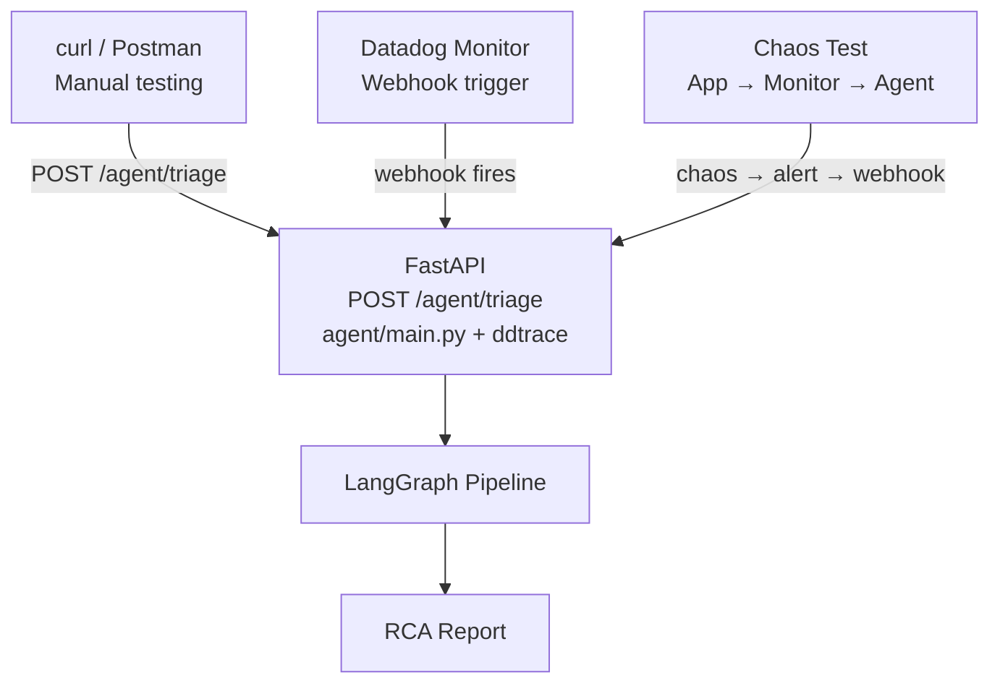

### Production flow — Datadog webhook

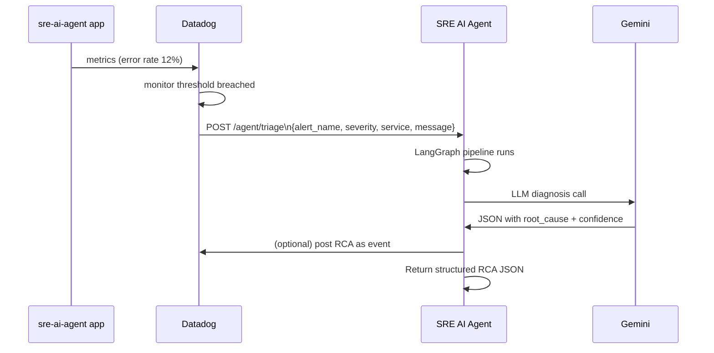

### Key architecture point (interview answer)

> "The application and agent are NOT directly connected. Datadog acts as the
> bridge. The app generates metrics → Datadog monitors them → Datadog fires
> a webhook to the agent when a threshold is breached. This is loose coupling —
> the agent can receive alerts from ANY service, not just one."

---

## 5. How Does LangGraph Retrieve Runbooks?

Node 2 (`runbook_retriever.py`) calls the RAG pipeline:

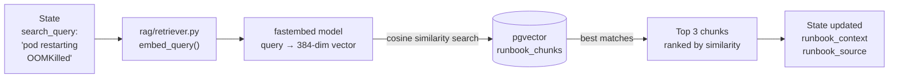

### What the SQL query looks like

```sql
SELECT
    source,
    content,
    1 - (embedding <=> '[0.23,-0.87,0.45,...]'::vector) AS similarity
FROM runbook_chunks
ORDER BY embedding <=> '[0.23,-0.87,0.45,...]'::vector
LIMIT 3;
```

Results for "OOMKilled pod restart":
```
source              similarity
pod-restarts.md     0.87   ← best match
pod-restarts.md     0.82
api-5xx.md          0.71
```

The `<=>` operator is pgvector's cosine distance — measures angle between vectors.
Smaller angle = more similar meaning.

---

## 6. How Does RAG Work?

**RAG = Retrieval-Augmented Generation**

### The problem RAG solves

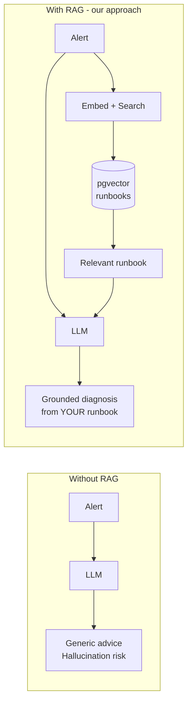

### Phase 1 — Indexing (run once)

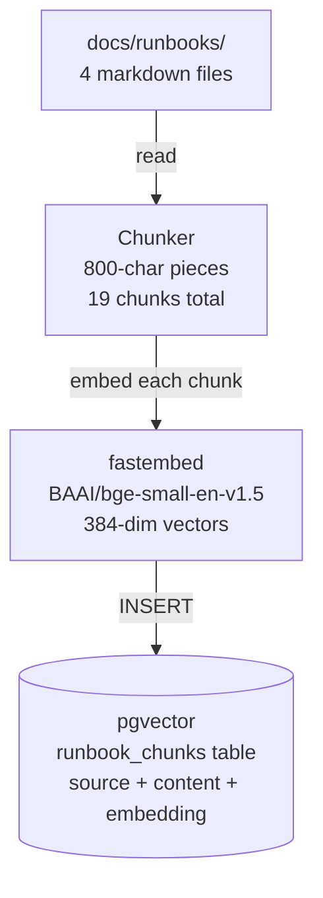

### Phase 2 — Runtime (every alert)

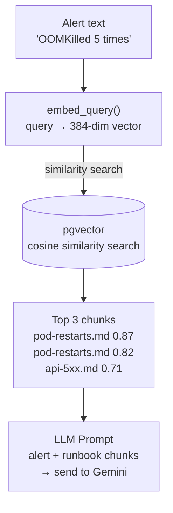

### What are embeddings?

Numbers representing the **meaning** of text — not the words, the meaning:

```
"pod is crashing"       → [0.23, -0.87, 0.45, ...]  (384 numbers)
"container restarting"  → [0.21, -0.85, 0.47, ...]  SIMILAR numbers
"quarterly revenue"     → [0.91,  0.34, -0.22, ...]  VERY DIFFERENT
```

Similar meaning = similar numbers = close in vector space = pgvector finds the match.

### What is chunking and why?

Splitting large documents into smaller pieces before embedding.

```
api-5xx.md (1313 chars total)
├── Chunk 1 (800 chars): "# Runbook: High Error Rate\n## Alert\n## Impact..."
├── Chunk 2 (700 chars): "## Diagnosis Steps\n### 1. Check pod status..."
└── Chunk 3 (400 chars): "## Mitigation\nRollback deployment..."

19 total chunks across 4 runbooks:
  api-5xx.md          → 3 chunks
  api-availability.md → 7 chunks
  high-latency.md     → 4 chunks
  pod-restarts.md     → 5 chunks
```

Why chunk? LLMs have context limits. Smaller chunks = more precise retrieval.
We find the specific chunk about the symptom, not the whole file.

---

## 7. How Does pgvector Work? (Vector Database Deep-Dive)

### Are we using a vector database?

**Yes.** pgvector is a vector database. It is PostgreSQL + the `vector` extension, which adds:
- A new data type: `vector(384)` — a column that stores 384 numbers
- New operators: `<=>` (cosine distance), `<->` (L2 distance), `<#>` (inner product)
- Indexes: `ivfflat` and `hnsw` for fast similarity search

### How pgvector stores data

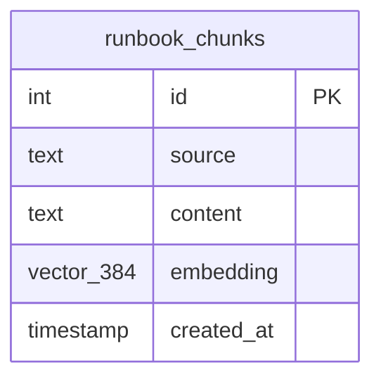

Actual rows in our table:

```
id | source           | content (first 60 chars)            | embedding
---+------------------+-------------------------------------+------------------
 1 | api-5xx.md       | # Runbook: High Error Rate (5xx)... | [0.23,-0.87,...]
 2 | api-5xx.md       | | Symptom | Cause | Fix |...        | [0.19,-0.91,...]
 3 | api-5xx.md       | Datadog → Monitors → [sre-ai-age... | [0.44, 0.23,...]
 4 | api-avail...     | # Runbook: API Availability...      | [0.55,-0.34,...]
... 19 rows total
```

### How similarity search works

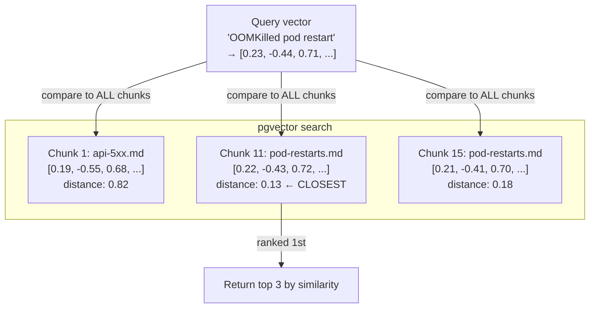

### Cosine similarity explained simply

```
Two vectors pointing in same direction = similar meaning (similarity near 1.0)
Two vectors pointing opposite directions = opposite meaning (similarity near -1.0)
Two vectors at right angles = unrelated (similarity near 0.0)

"pod crashing" and "container restarting" → almost same direction → similarity 0.87
"pod crashing" and "quarterly revenue"    → very different direction → similarity 0.12
```

### The ivfflat index — how it makes search FAST

Without an index: pgvector compares query against EVERY row. Slow for large datasets.

With ivfflat index: vectors are grouped into clusters. Search only happens within the nearest cluster.

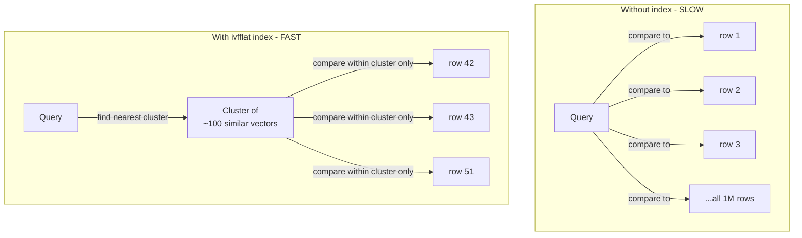

Our index:
```sql
CREATE INDEX runbook_chunks_embedding_idx
    ON runbook_chunks
    USING ivfflat (embedding vector_cosine_ops)
    WITH (lists = 10);   -- 10 clusters for our 19 chunks
```

`lists = 10` = divide vectors into 10 groups.
For 19 chunks this is overkill (index warning is expected and fine).
For 100,000 chunks: `lists = 100` is recommended.

### ivfflat vs hnsw — which index to use?

| Index | Max dims | Speed | Accuracy | Best for |
|---|---|---|---|---|
| ivfflat | 2000 | Fast build | Good | Small-medium datasets |
| hnsw | 2000 | Fast search | Better | Large datasets |
| No index | Unlimited | Slow (brute force) | Perfect | Tiny datasets |

We use ivfflat with 384 dimensions — well within the 2000 limit.

### Why pgvector instead of a dedicated vector DB?

| pgvector (our choice) | Pinecone / Weaviate |
|---|---|
| PostgreSQL — you already know SQL | New query language to learn |
| Single service to manage | Separate service, separate cost |
| Combines vector + relational queries | Vector search only |
| Free and open source | Paid / complex pricing |
| Good for < 1M vectors | Better for millions of vectors |
| Runs in Docker, any cloud | Managed cloud service |

### Full pgvector flow in our project

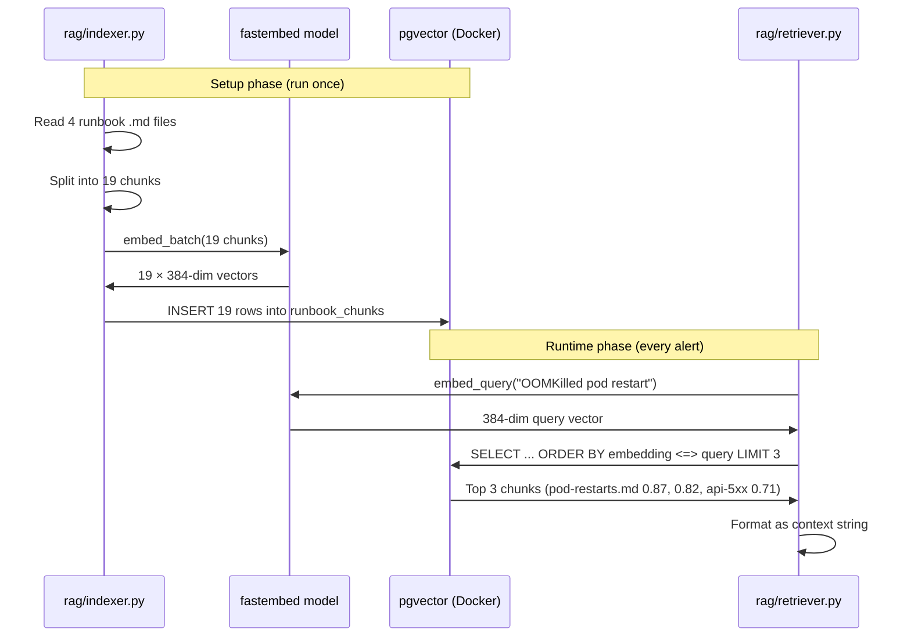

### Interview answer: "Are you using a vector database?"

> "Yes — we use pgvector, which is PostgreSQL with the vector extension. It stores
> 384-dimensional embeddings of our runbook chunks. When an alert comes in, we
> embed it with fastembed, then use pgvector's cosine similarity search to find
> the most relevant runbook chunk in milliseconds. We chose pgvector over
> dedicated vector databases like Pinecone because we already use PostgreSQL, it
> supports both vector and relational queries in one service, and our dataset of
> 19 chunks doesn't need a dedicated vector DB. For larger scale (millions of
> vectors), we'd consider migrating to a dedicated solution."

---

## 8. What is an LLM and How Does It Do Diagnosis?

**LLM = Large Language Model** — a neural network trained on billions of text documents.

### How an LLM works (simple)

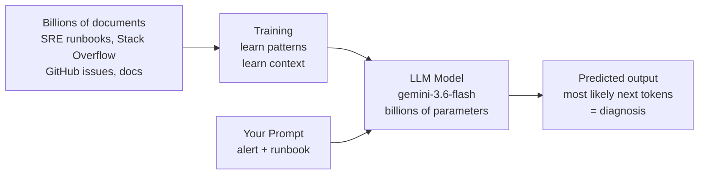

### Prompt structure we use (prompt engineering)

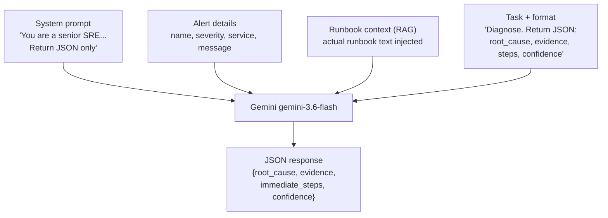

### Actual prompt flow for Pod Restart alert

```
SYSTEM: "You are a senior SRE. Return structured JSON only."

USER:   "Alert: Pod Restart Rate High (P2)
         Service: sre-ai-agent
         Message: Pod restarted 5 times in 10 minutes, OOMKilled

         Relevant Runbook:
         --- pod-restarts.md (similarity: 0.87) ---
         OOMKilled → Memory limit too low → increase memory limits
         kubectl describe pod -n sre-ai-agent...
         kubectl logs --previous...

         Diagnose root cause. Return:
         { root_cause, evidence[], immediate_steps[], confidence }"

GEMINI: {
          "root_cause": "Pod OOMKilled — memory limit too low",
          "evidence": ["OOMKilled in alert", "Runbook maps OOMKilled → memory limit"],
          "immediate_steps": ["kubectl describe pod...", "increase memory limits"],
          "confidence": 0.95
        }
```

### Model we use and why

```
gemini-3.6-flash
├── Free tier — no credit card needed
├── Fast — response in ~2 seconds
├── Good quality for structured JSON output
└── Available via google-generativeai Python SDK
```

To find available models:
```python
for m in genai.list_models():
    if 'generateContent' in m.supported_generation_methods:
        print(m.name)
```

---

## 9. How is Confidence Measured?

Confidence is **self-reported by the LLM** in its JSON response — not calculated by a formula.

The LLM reasons about: "How well does the runbook match this alert? How certain am I?"

### Confidence decision flow

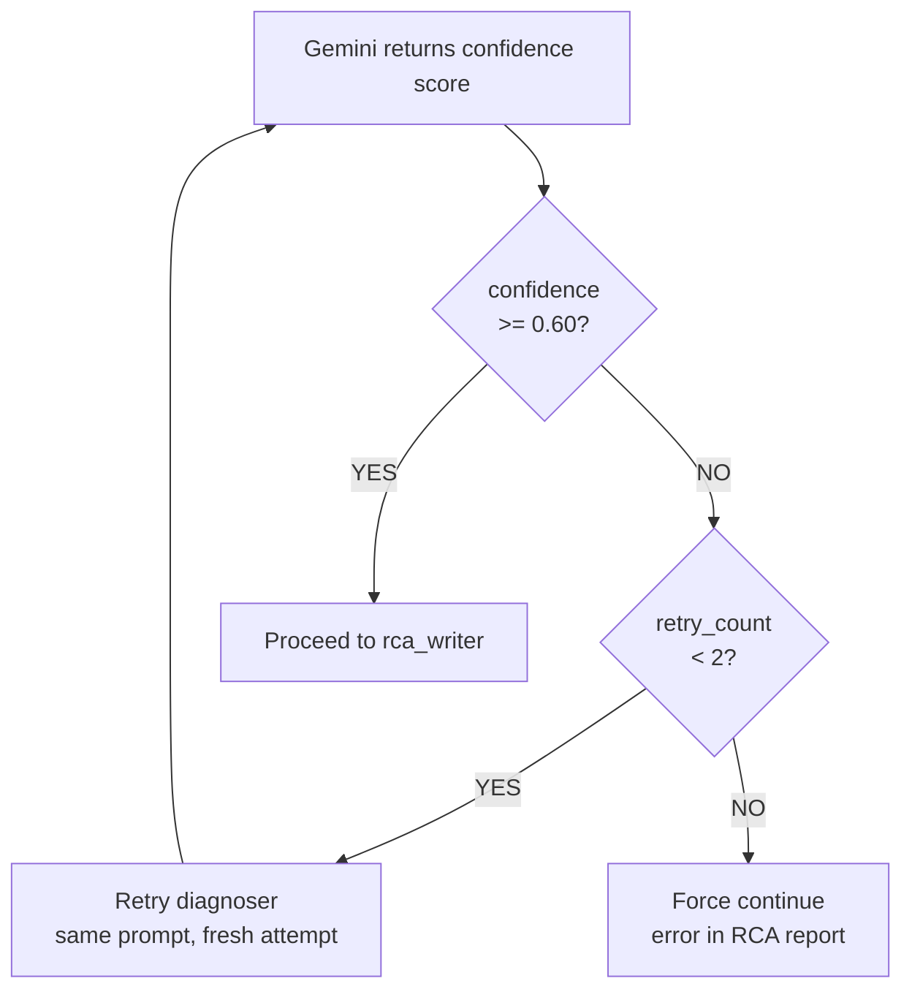

### What drives confidence — our test results

| Alert | Runbook | Score | Why |
|---|---|---|---|
| Pod Restart (OOMKilled) | pod-restarts.md | **0.95** | "OOMKilled" is specific, maps exactly to runbook |
| High Error Rate | api-5xx.md | 0.30 | Generic alert, no pod logs, multiple possible causes |
| High Latency | high-latency.md | 0.30 | Could be resource pressure, bad deploy, or GC pauses |
| API Availability | api-availability.md | 0.10 | Vague alert, runbook too thin on diagnostic steps |

### Confidence scale

```
0.0 ──────────── 0.60 ──────────── 0.85 ──── 1.0
     LOW                MEDIUM           HIGH
  Human review       Acceptable      Confident
  required           quality         diagnosis
     ↑                                   ↑
  All our generic              Pod Restart (OOMKilled)
  alerts land here             lands here
```

### Key interview point

Low confidence = **honest AI**, not broken AI. An LLM saying "I'm not sure" is far better than hallucinating a wrong root cause that leads an SRE to take the wrong action in production.

---

## 10. How to Format the RCA Report?

Currently RCA is plain markdown text in the JSON response.

### RCA formatting options

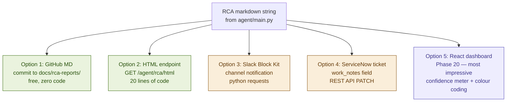

### Option 1 — GitHub markdown (easiest)

```bash
# Save RCA as dated markdown file and push
echo "$RCA_RESPONSE" > docs/rca-reports/incident-$(date +%Y%m%d-%H%M).md
git add . && git commit -m "rca: pod restart incident" && git push
```

GitHub renders it as a formatted document with tables, bold headings, code blocks.

### Option 2 — HTML endpoint (recommended next step)

Add to `agent/main.py`:

```python
import markdown as md

@app.get("/agent/rca/{incident_id}/html")
def rca_html(incident_id: str):
    rca = get_rca_from_store(incident_id)
    html_content = md.markdown(rca, extensions=['tables', 'fenced_code'])
    styled = f"""
    <html><head>
    <style>
      body {{ font-family: sans-serif; max-width: 800px; margin: 40px auto; }}
      table {{ border-collapse: collapse; width: 100%; }}
      td, th {{ border: 1px solid #ddd; padding: 8px; }}
      code {{ background: #f4f4f4; padding: 2px 4px; border-radius: 3px; }}
    </style></head>
    <body>{html_content}</body></html>"""
    return HTMLResponse(content=styled)
```

`pip install markdown`

### Option 3 — Slack Block Kit

```python
def send_rca_to_slack(rca: str, confidence: float, webhook_url: str):
    emoji = "✅" if confidence >= 0.85 else "⚠️" if confidence >= 0.60 else "❌"
    requests.post(webhook_url, json={
        "blocks": [
            {"type": "header", "text": {"type": "plain_text",
             "text": f"{emoji} AI-Generated RCA Report"}},
            {"type": "section", "text": {"type": "mrkdwn",
             "text": rca[:3000]}},
            {"type": "context", "elements": [
                {"type": "mrkdwn",
                 "text": f"Confidence: {confidence:.0%} | Generated by SRE AI Agent"}
            ]}
        ]
    })
```

### Option 4 — ServiceNow (most production-realistic, matches JD)

```python
def post_rca_to_servicenow(incident_id: str, rca: str, confidence: float):
    requests.patch(
        f"{SNOW_URL}/api/now/table/incident/{incident_id}",
        json={
            "work_notes": f"[AI-Generated RCA — Confidence: {confidence:.0%}]\n\n{rca}",
            "state": "2"   # In Progress
        },
        auth=(SNOW_USER, SNOW_PASS),
        headers={"Content-Type": "application/json"}
    )
```

---

## 11. Interview Q&A — SRE Role

### Q: What is an SRE and what do they do?
**A:** An SRE (Site Reliability Engineer) applies software engineering principles to operations problems. Core responsibilities: ensuring reliability and availability of production systems, defining and tracking SLOs/SLIs, incident response, postmortem analysis, reducing toil through automation, and capacity planning.

---

### Q: What is the difference between SLI, SLO, and SLA?

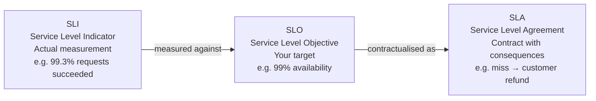

In our project: We created SLOs in Datadog — Availability (99% target) and Latency p99 < 2s (90% target).

---

### Q: Walk me through how you would handle a P1 incident.

**A:**
1. Acknowledge the alert immediately
2. Join the incident channel / bridge
3. Assess impact: who is affected, what percentage of traffic
4. Check recent deployments — most common cause
5. Look at dashboards: error rate, latency, pod health
6. Triage: rollback if recent deploy, scale up if resource pressure
7. Communicate status updates every 5-10 minutes
8. Resolve and verify recovery
9. Write postmortem within 24-48 hours

In our project: The AI agent automates steps 4-6 — it retrieves the runbook and suggests remediation steps automatically.

---

### Q: What is the difference between monitoring and observability?

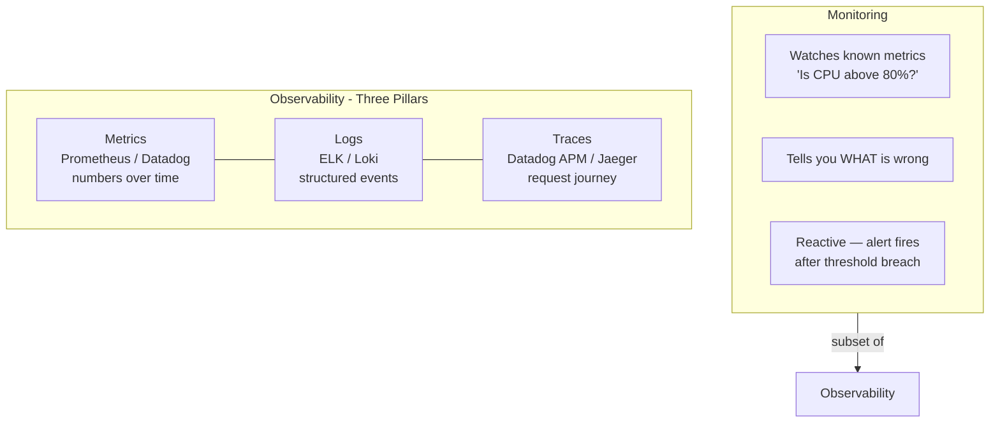

Observability tells you WHY it's wrong, not just WHAT is wrong.

---

### Q: What are the Golden Signals?

**A:** Four metrics that cover most production issues (from Google SRE Book):

| Signal | What it measures | Our project |
|---|---|---|
| **Traffic** | Requests per second | Datadog trace.fastapi.request |
| **Latency** | Response time (p50, p99) | p99 < 2s SLO |
| **Errors** | Rate of 5xx responses | High Error Rate monitor |
| **Saturation** | How full (CPU, memory, queue) | Pod resource monitors |

In our project: We built a Golden Signals dashboard in Datadog (Phase 9).

---

### Q: What is error budget and how do you use it?

**A:** Error budget = 100% - SLO target.
- SLO = 99.9% → error budget = 0.1% = ~43 minutes of downtime per month
- Budget healthy → deploy freely, move fast
- Budget low → freeze deployments, focus on reliability
- Budget exhausted → all hands on reliability, no new features

---

### Q: What is an RCA and what should it contain?

**A:** Root Cause Analysis — a structured document answering:
what happened → why it happened → how we detected it → how we resolved it → what prevents recurrence.

In our project, the AI agent generates this automatically. Our RCA template:
- Incident summary table (alert, severity, service, timestamp)
- Alert message
- Root cause + evidence + immediate steps
- Runbook reference
- Next steps
- Disclaimer (AI-generated, validate before executing)

---

## 12. Interview Q&A — Senior SRE Role

### Q: How do you design SLOs for a service?

```mermaid
flowchart TD
    UJ["1. User journey\nWhat does user care about?"]
    SLI["2. Define SLIs\navailability, latency, throughput"]
    T["3. Set targets\nbased on historical data"]
    EB["4. Error budget policy\nwhat happens when consumed?"]
    R["5. Review quarterly\nadjust as service matures"]

    UJ --> SLI --> T --> EB --> R
```

---

### Q: How would you approach reducing MTTR (Mean Time to Repair)?

**A:**
- Better alerting: alert on symptoms (user impact), not causes (CPU %)
- Runbook automation: what we built — agent finds the right runbook instantly
- Chaos engineering: break things in controlled way to find weaknesses before users do
- Postmortem action items: each incident should improve the next response
- Oncall training: rotate engineers through incidents so knowledge spreads

---

### Q: How do you handle alert fatigue?

**A:**
- Audit every alert: does it require human action? If not, delete it
- Group related alerts — one root cause should fire one alert, not ten
- Set appropriate thresholds — alert when users are impacted, not at 80% CPU
- Use inhibition rules: suppress downstream alerts when root cause fires
- Measure: track alert volume, MTTA (time to acknowledge), noise ratio

---

### Q: How do you ensure reliability when deploying frequently?

```mermaid
flowchart LR
    PR["PR merged"] --> CI["CI: tests pass"]
    CI --> CD["CD: deploy"]
    CD --> CAN["Canary: 5% traffic"]
    CAN --> M["Monitor SLO\nerror budget"]
    M -->|healthy| FULL["Full rollout 100%"]
    M -->|budget spike| RB["Auto-rollback"]
```

---

### Q: What is your experience with Kubernetes reliability?

**A (from our project):**
- Deployed to EKS with HPA (Horizontal Pod Autoscaler) for automatic scaling
- Configured resource limits to prevent OOMKilled issues
- Used Datadog Kubernetes Explorer to monitor cluster health
- Ran chaos scenarios (crashloop, OOMKilled, high error rate, availability drop) — all monitors fired correctly
- Wrote runbooks for each failure mode — now indexed in pgvector for AI retrieval

---

## 13. Interview Q&A — AI Platform Engineer Role

### Q: What is an agentic AI system?

**A:** An AI system that takes autonomous, multi-step actions to complete a goal — rather than answering a single question.

```mermaid
flowchart LR
    subgraph Chatbot - not agentic
        Q1[Question] --> A1[Single answer]
    end

    subgraph Agentic system - what we built
        I[Incident alert]
        I --> S1[Step 1: Parse alert]
        S1 --> S2[Step 2: Search runbooks]
        S2 --> S3[Step 3: LLM diagnosis]
        S3 --> S4[Step 4: Format RCA]
        S4 --> O[Structured output]
    end
```

Key properties: has tools, has state, can make decisions, produces real-world outputs.

---

### Q: What is RAG and why is it important?

**A:** Retrieval-Augmented Generation — give the LLM your own documents as context.

Important because LLMs only know general internet data. They don't know your runbooks, your service names, your thresholds. Without RAG = hallucination. With RAG = grounded, accurate diagnosis.

We built RAG with: `fastembed` (embed) + `pgvector` (store + search) + 4 runbooks (knowledge base).

---

### Q: What is a vector database and when would you use it?

**A:** A database that stores high-dimensional vectors and can search for the most similar ones efficiently.

Use when you need **semantic search** — finding documents by meaning, not exact keyword match.

Examples:
- Runbook retrieval (our project)
- Document search ("find issues similar to this one")
- Recommendation systems
- Duplicate detection

We used pgvector — PostgreSQL with vector extension.

---

### Q: How do you evaluate LLM output quality?

```mermaid
flowchart LR
    AR["Answer Relevance\nIs response relevant\nto the alert?"]
    FA["Faithfulness\nDoes it stick to runbook?\nNo hallucination?"]
    CR["Context Recall\nDid RAG find\nthe right runbook?"]
    CM["Custom metrics\nDoes RCA have all\nrequired sections?"]

    AR --> SC["ragas scores\n→ Prometheus\n→ Grafana dashboard"]
    FA --> SC
    CR --> SC
    CM --> SC
```

Tools: `ragas` library, `promptfoo`, custom test harnesses with ground-truth datasets.
Phase 20 plan: implement evals with ragas, export scores to Prometheus.

---

### Q: What is prompt engineering?

**A:** Designing input prompts to get the best output from an LLM.

Key techniques we use in `diagnoser.py`:

| Technique | Example from our code |
|---|---|
| Role assignment | "You are a senior SRE..." |
| Structured context | "## Alert Details\n- Name: ..." |
| Output format | "Respond ONLY with valid JSON" |
| Confidence request | "Rate confidence 0.0 to 1.0" |
| Negative instruction | "Never hallucinate — say so if unsure" |

---

### Q: How do you handle LLM hallucination?

**A:**
- RAG: give the LLM actual runbooks as context (what we did)
- Output validation: parse and validate JSON response structure
- Confidence score: ask LLM to rate its own certainty
- Retry with same prompt on low-confidence responses (max 2 retries)
- Human review gates: flag low-confidence outputs with disclaimer banner
- Evals: automated testing to catch regression in answer quality

---

### Q: How do you make an AI system observable?

```mermaid
flowchart TD
    A["Every /agent/triage call"]
    T["ddtrace APM span\nalert.name, alert.severity\nagent.confidence, agent.runbook_used"]
    D["Datadog APM\nflame graph\ncustom tags"]
    P["Prometheus (Phase 20)\neval scores\nconfidence metrics"]
    G["Grafana dashboard\nAI quality over time"]

    A --> T --> D
    A --> P --> G
```

---

### Q: Describe your agentic workflow end-to-end.

> "I built a LangGraph SRE agent with a 4-node pipeline. When a production alert
> fires, Datadog sends a webhook to our FastAPI endpoint. Node 1 parses and
> classifies the alert. Node 2 retrieves the relevant runbook using RAG —
> fastembed embeds the alert, pgvector finds the most similar runbook chunks
> via cosine similarity. Node 3 sends alert plus runbook to Gemini gemini-3.6-flash
> and gets a structured JSON diagnosis with confidence score. If confidence is
> below 0.60, the graph loops back and retries. Node 4 formats the diagnosis
> into a structured RCA report. Every call is traced with ddtrace for Datadog
> APM observability. The Pod Restart scenario with OOMKilled achieved 95%
> confidence. The project repo is Machindra220/SRE-AI-Agent-Observability."

---

## 14. Tricky / Deep-Dive Questions

### Q: Why did you get low confidence on the High Error Rate alert?

**A:** Two reasons. First, the alert was generic — it said "12% errors" but didn't include which endpoint, what exception, or recent deployment info. Second, our api-5xx.md runbook is diagnostic (check logs, describe pods) rather than prescriptive (if X then Y). The LLM correctly rated its confidence low. This is correct behavior — better than hallucinating a wrong root cause. To improve: include runtime context (pod logs, recent deployments) in the alert payload alongside the alert text.

---

### Q: What would you change to make the agent more accurate?

```mermaid
flowchart TD
    A["Richer alert payload\ninclude pod logs,\nrecent deploy hash"] --> ACC
    B["Better runbooks\nif symptom → cause → fix\ndiagnostic trees"] --> ACC
    C["Larger RAG corpus\nindex past RCAs\nlearn from history"] --> ACC
    D["Evals feedback loop\nweekly ragas scores\nimprove low-confidence runbooks"] --> ACC
    E["Multi-step tool calling\nagent runs kubectl\nuses output in reasoning"] --> ACC

    ACC["Higher confidence\nmore accurate diagnosis"]
```

---

### Q: Why did you choose pgvector over Pinecone or Weaviate?

| Reason | Details |
|---|---|
| Already know SQL | No new query language to learn |
| Single service | No separate vector DB to manage, monitor, or pay for |
| Combined queries | Vector + relational in one database |
| Free and open source | No vendor lock-in |
| Right size for our data | 19 chunks — dedicated vector DB is overkill |

For larger scale (millions of vectors), Pinecone or Weaviate would be better choices.

---

### Q: How would you scale this agent to handle 1000 alerts per minute?

```mermaid
flowchart TD
    A["1000 alerts/min"]
    Q["SQS Queue\ndecouple ingestion\nfrom processing"]
    W["Agent workers\nmultiple EKS pods\nHPA auto-scaling"]
    P["PgBouncer\nconnection pooling\nfor pgvector"]
    C["Embedding cache\ncache vectors for\nfrequent alert patterns"]
    G["Gemini quota\nmultiple API keys\nrequest queuing"]

    A --> Q --> W
    W --> P
    W --> C
    W --> G
```

---

### Q: What is the risk of using an LLM for production incident diagnosis?

| Risk | Mitigation in our project |
|---|---|
| Hallucination | RAG grounds LLM in actual runbooks |
| Wrong diagnosis | Confidence threshold + human review disclaimer |
| LLM API down | Fallback to raw runbook retrieval only |
| Latency (2-5s) | Acceptable for RCA, not for real-time alerting |
| Prompt injection | Sanitize alert content before injecting into prompt |
| Cost | ~$0.005 per triage — budget for volume |

---

### Q: How is your project different from just using ChatGPT for diagnosis?

| ChatGPT | Our SRE AI Agent |
|---|---|
| Human copies and pastes alert | Automatic — triggered by Datadog webhook |
| Generic internet knowledge | RAG grounds it in YOUR runbooks |
| Free-form chat output | Structured JSON → formatted RCA |
| No audit trail | ddtrace → Datadog APM — full trace |
| No state between steps | LangGraph State tracks full diagnostic context |
| No retry logic | Auto-retries if confidence < 0.60 |
| Not production-ready | FastAPI, error handling, confidence gating |

---

### Q: Explain cosine similarity in simple terms.

**A:** Imagine two arrows pointing in space. Cosine similarity measures the angle between them — not how long they are, just which direction they point.

```
"pod crashing"      ↗  (direction: pod + failure)
"container restart" ↗  (almost same direction) → similarity: 0.87 HIGH

"pod crashing"      ↗  (direction: pod + failure)
"quarterly revenue" →  (completely different direction) → similarity: 0.12 LOW
```

pgvector uses this to find which stored runbook chunk points in the most similar direction to your alert — meaning the one most likely to be relevant.

---

*Document generated from Phase 19 build of SRE-AI-Agent-Observability*
*GitHub: Machindra220/SRE-AI-Agent-Observability*
*Last updated: September 2026*