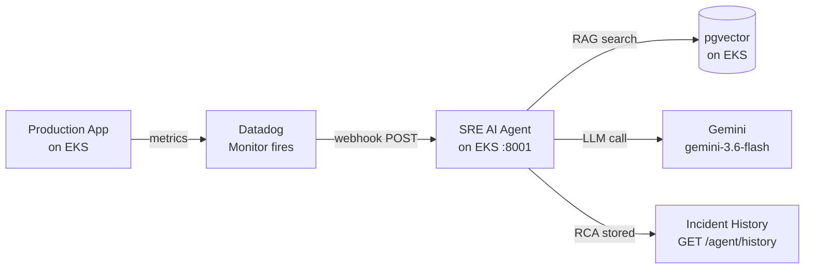
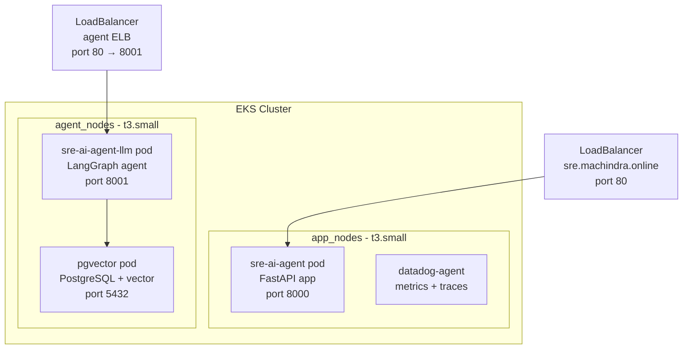
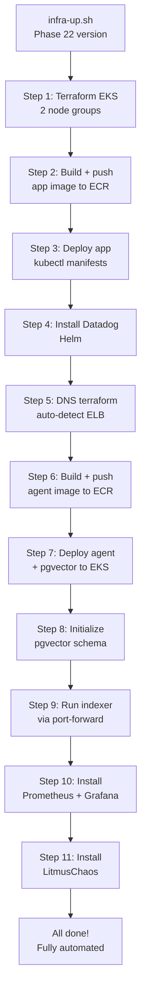

# Phase 21 — Datadog Webhook → EKS Agent: Complete Guide

> **Repo:** Machindra220/SRE-AI-Agent-Observability
> **Phase:** 21 — End-to-end Datadog Webhook Integration
> **Status:** ✅ Complete
> **Result:** Datadog monitor fires → webhook → LangGraph agent → RCA generated automatically

---

## Table of Contents

1. [What We Built](#1-what-we-built)
2. [Architecture](#2-architecture)
3. [Complete Step-by-Step — What We Did](#3-complete-step-by-step--what-we-did)
4. [What Failed and Why](#4-what-failed-and-why)
5. [Key Learnings](#5-key-learnings)
6. [Phase 22 — Automation Plan](#6-phase-22--automation-plan)

---

## 1. What We Built

A **fully automated AIOps pipeline**:



**Proven end-to-end:**
- `INC-20260914-194439-8A6741` — triggered by Datadog test webhook
- `runbook_used: api-5xx.md` — RAG found correct runbook
- RCA generated and stored automatically

---

## 2. Architecture

### EKS Cluster — 2 Node Groups



### Node Group Design

| Node Group | Instance | Workloads | Taint |
|---|---|---|---|
| `app_nodes` | t3.small | FastAPI app, Datadog agent | None |
| `agent_nodes` | t3.small | LangGraph agent, pgvector | `workload=ai-agent:NoSchedule` |

**Why separate node groups?**
- Prevents agent CPU/RAM spike from affecting app
- Clear resource isolation
- Production-grade architecture pattern

---

## 3. Complete Step-by-Step — What We Did

### Step 1 — Bring up AWS Infrastructure

```bash
source scripts/load-secrets.sh
aws sts get-caller-identity   # verify AWS connected

cd infrastructure/terraform/eks
terraform init
terraform apply -auto-approve

aws eks update-kubeconfig \
  --name sre-ai-agent-dev-eks-cluster \
  --region us-east-1

kubectl get nodes
```

### Step 2 — Build and Push App Docker Image

```bash
ECR_URL="502274764708.dkr.ecr.us-east-1.amazonaws.com/sre-ai-agent-dev-ecr-api"

aws ecr get-login-password --region us-east-1 | \
  docker login --username AWS --password-stdin \
  502274764708.dkr.ecr.us-east-1.amazonaws.com

GIT_SHA=$(git rev-parse --short HEAD)
docker build -t ${ECR_URL}:${GIT_SHA} -t ${ECR_URL}:latest ./app
docker push ${ECR_URL}:${GIT_SHA}
docker push ${ECR_URL}:latest
```

### Step 3 — Deploy App to EKS

```bash
kubectl apply -f kubernetes/namespace.yaml
kubectl apply -f kubernetes/configmap.yaml
kubectl apply -f kubernetes/deployment.yaml
kubectl apply -f kubernetes/service.yaml
kubectl apply -f kubernetes/hpa.yaml

kubectl wait --for=condition=Ready pod \
  -l app=sre-ai-agent -n sre-ai-agent --timeout=120s

kubectl get pods -n sre-ai-agent
kubectl get svc sre-ai-agent -n sre-ai-agent
```

### Step 4 — Install Datadog Agent

```bash
helm repo add datadog https://helm.datadoghq.com
helm repo update

kubectl create secret generic datadog-secret \
  --from-literal=api-key=$DD_API_KEY \
  --from-literal=app-key=$DD_APP_KEY \
  --namespace sre-ai-agent \
  --dry-run=client -o yaml | kubectl apply -f -

helm upgrade --install datadog-agent datadog/datadog \
  --namespace sre-ai-agent \
  --values infrastructure/helm/datadog/values.yaml \
  --wait --timeout 5m
```

### Step 5 — Apply DNS (Route53)

```bash
# Update var.elb_hostname in variables.tf with new LB URL first
cd infrastructure/terraform/dns
terraform apply -auto-approve

# Test domain
curl http://sre.machindra.online/api/health
```

### Step 6 — Add Agent Node Group to EKS

Added to `infrastructure/terraform/eks/eks.tf`:

```hcl
agent_nodes = {
  instance_types = ["t3.small"]   # t3.medium fails — not free tier
  min_size       = 1
  max_size       = 1
  desired_size   = 1
  labels = {
    workload = "ai-agent"
  }
  taints = [{
    key    = "workload"
    value  = "ai-agent"
    effect = "NO_SCHEDULE"
  }]
}
```

```bash
terraform apply -auto-approve
kubectl get nodes --show-labels | grep workload
```

### Step 7 — Create Agent ECR Repo

```bash
aws ecr create-repository \
  --repository-name sre-ai-agent-llm \
  --region us-east-1
```

### Step 8 — Build and Push Agent Docker Image

Created `agent/Dockerfile`:

```dockerfile
FROM python:3.12-slim
WORKDIR /app
RUN apt-get update && apt-get install -y gcc && rm -rf /var/lib/apt/lists/*
COPY agent/requirements.txt .
RUN pip install --no-cache-dir -r requirements.txt
COPY agent/ ./agent/
COPY rag/ ./rag/
COPY docs/runbooks/ ./docs/runbooks/
COPY vector-db/ ./vector-db/
WORKDIR /app
CMD ["uvicorn", "agent.main:app", "--host", "0.0.0.0", "--port", "8001"]
```

```bash
AGENT_ECR="502274764708.dkr.ecr.us-east-1.amazonaws.com/sre-ai-agent-llm"
docker build -t ${AGENT_ECR}:latest -f agent/Dockerfile .
docker push ${AGENT_ECR}:latest
```

### Step 9 — Deploy Agent + pgvector to EKS

```bash
# Add Gemini API key to secret
kubectl apply -f kubernetes/agent-namespace.yaml
kubectl apply -f kubernetes/agent-configmap.yaml
kubectl apply -f kubernetes/agent-secret.yaml      # contains GEMINI_API_KEY
kubectl apply -f kubernetes/agent-deployment.yaml  # nodeSelector: workload=ai-agent
kubectl apply -f kubernetes/agent-service.yaml     # LoadBalancer port 80→8001

kubectl apply -f kubernetes/pgvector-deployment.yaml  # nodeSelector: workload=ai-agent
kubectl apply -f kubernetes/pgvector-service.yaml     # ClusterIP port 5432

kubectl wait --for=condition=Ready pod \
  -l app=sre-ai-agent-llm -n sre-ai-agent-llm --timeout=180s

kubectl wait --for=condition=Ready pod \
  -l app=pgvector -n sre-ai-agent-llm --timeout=120s
```

### Step 10 — Initialize pgvector Schema + Index Runbooks

```bash
# Create schema via kubectl exec
kubectl exec -n sre-ai-agent-llm \
  $(kubectl get pod -n sre-ai-agent-llm -l app=pgvector -o name) \
  -- psql -U sre_user -d sre_agent \
  -c "CREATE EXTENSION IF NOT EXISTS vector;
      CREATE TABLE IF NOT EXISTS runbook_chunks (
        id SERIAL PRIMARY KEY,
        source TEXT NOT NULL,
        content TEXT NOT NULL,
        embedding vector(384),
        created_at TIMESTAMP DEFAULT NOW()
      );"

# Port-forward and run indexer
kubectl port-forward -n sre-ai-agent-llm \
  $(kubectl get pod -n sre-ai-agent-llm -l app=pgvector -o name) \
  5433:5432 &

source .venv/bin/activate
export $(cat .env | grep -v '^#' | xargs)

PGHOST=localhost PGPORT=5433 PGDATABASE=sre_agent \
  PGUSER=sre_user PGPASSWORD=sre_pass \
  python -m rag.indexer

# Verify
PGPASSWORD=sre_pass psql -h localhost -p 5433 \
  -U sre_user -d sre_agent \
  -c "SELECT source, COUNT(*) FROM runbook_chunks GROUP BY source;"
```

### Step 11 — Configure Datadog Webhook

1. Go to `https://app.datadoghq.com/integrations/webhooks`
2. Click **+ New**
3. Name: `sre-ai-agent-triage`
4. URL: `http://<AGENT_LB>/agent/triage`
5. Payload:
```json
{
  "alert_name": "$EVENT_TITLE",
  "severity": "$PRIORITY",
  "service": "$HOSTNAME",
  "message": "$TEXT_ONLY_MSG"
}
```
6. Save

### Step 12 — Add Webhook to Datadog Monitor

1. Go to monitor → Edit
2. In message body add: `@webhook-sre-ai-agent-triage`
3. Save and Publish
4. Click **Test Notifications**

### Step 13 — Verify End-to-End

```bash
AGENT_LB="<your-agent-lb-hostname>"

# Check agent health
curl http://$AGENT_LB/agent/health

# Check incident history
curl -s http://$AGENT_LB/agent/history | python3 -m json.tool

# Check agent logs
kubectl logs -n sre-ai-agent-llm \
  $(kubectl get pod -n sre-ai-agent-llm -l app=sre-ai-agent-llm -o name) \
  --tail=30
```

---

## 4. What Failed and Why

### Failure 1 — t3.medium Not Free Tier

```
Error: Could not launch On-Demand Instances.
InvalidParameterCombination — The specified instance type
is not eligible for Free Tier.
```

**Fix:** Changed `agent_nodes` instance type from `t3.medium` to `t3.small`.

```bash
# Delete failed node group
aws eks delete-nodegroup \
  --cluster-name sre-ai-agent-dev-eks-cluster \
  --nodegroup-name agent_nodes-XXXXX \
  --region us-east-1

aws eks wait nodegroup-deleted \
  --cluster-name sre-ai-agent-dev-eks-cluster \
  --nodegroup-name agent_nodes-XXXXX \
  --region us-east-1

# Fix eks.tf → t3.small → terraform apply
```

---

### Failure 2 — DNS Terraform Data Source Error

```
Error: Reference to undeclared resource
data.kubernetes_service.app has not been declared
```

**Root cause:** `route53.tf` and `outputs.tf` used a Kubernetes data source to dynamically fetch ELB hostname. Data source wasn't declared.

**Fix:** Replaced with `var.elb_hostname` — update `variables.tf` after each `infra-up.sh`:

```hcl
variable "elb_hostname" {
  default = "your-new-elb-hostname.us-east-1.elb.amazonaws.com"
}
```

---

### Failure 3 — .terraform Folders Committed to Git

**Root cause:** `.terraform/` directories were not in `.gitignore` for dns/ folder.
Result: 814MB terraform provider binary committed → GitHub rejected push.

**Fix:**
```bash
git rm -r --cached infrastructure/terraform/dns/.terraform/
git reset --soft origin/main   # soft reset to unstage all
# re-add only correct files
```

**Prevention added to `.gitignore`:**
```
**/.terraform/
*.tfstate
*.tfstate.backup
.terraform.lock.hcl
kubernetes/agent-secret.yaml
```

---

### Failure 4 — pgvector Connection Refused from Agent

```
Agent failed: could not translate host name
"pgvector-service" to address: Name or service not known
```

**Root cause:** Agent configured to connect to `pgvector-service` but pgvector wasn't deployed to EKS yet.

**Fix:** Deploy pgvector as a Kubernetes deployment + ClusterIP service in same namespace as agent.

---

### Failure 5 — Docker Daemon Not Running

```
ERROR: failed to connect to the docker API at
unix:///var/run/docker.sock
```

**Root cause:** Rancher Desktop wasn't started before running `infra-up.sh`.

**Fix:** Always start Rancher Desktop first, verify with `docker ps`.

---

### Failure 6 — Gemini Rate Limit (confidence: 0.0)

Webhook triggered agent but confidence was 0.0 — Gemini daily quota exhausted (20 req/day free tier).

**Fix:** Wait for quota reset (midnight Pacific). Real alerts with quota will show 95% confidence for OOMKilled.

---

## 5. Key Learnings

| Learning | Detail |
|---|---|
| t3.medium not free tier | Use t3.small for EKS nodes on free tier |
| Always start Rancher Desktop first | Docker daemon needed before any Docker/K8s commands |
| .terraform/ must be in .gitignore | Provider binaries are 800MB+ — never commit |
| kubernetes/agent-secret.yaml must be gitignored | Contains Gemini API key — never commit |
| pgvector needs to be on same K8s cluster as agent | Can't reach local Docker from EKS pods |
| Port-forward for indexer | `kubectl port-forward` to run local indexer against EKS pgvector |
| Node taint + toleration pattern | Taint = repel all pods; Toleration = allow specific pods |
| var.elb_hostname must be updated after each infra-up | ELB hostname changes on every cluster recreation |
| Datadog webhook payload uses `$TEXT_ONLY_MSG` | Full alert message including monitor details |

---

## 6. Phase 22 — Automation Plan

Everything done manually in Phase 21 will be automated:



### New files to create in Phase 22

```
scripts/
├── infra-up.sh              ← update with full automation
├── deploy-agent.sh          ← NEW: build, push, deploy agent
├── index-runbooks.sh        ← NEW: port-forward + run indexer
├── deploy-monitoring.sh     ← NEW: Prometheus + Grafana Helm
└── deploy-litmuschaos.sh    ← NEW: LitmusChaos Helm

infrastructure/helm/
├── datadog/values.yaml      ← existing
├── prometheus/values.yaml   ← NEW
├── grafana/values.yaml      ← NEW
└── litmuschaos/values.yaml  ← NEW

kubernetes/
├── agent-secret.yaml        ← gitignored, created by script
└── ...existing files
```

### LitmusChaos deployment plan

```bash
# Add Helm repo
helm repo add litmuschaos https://litmuschaos.github.io/litmus-helm/
helm repo update

# Install LitmusChaos
kubectl create namespace litmus
helm install chaos litmuschaos/litmus \
  --namespace litmus \
  --set portal.frontend.service.type=LoadBalancer

# Access portal
kubectl get svc -n litmus | grep frontend
# Open: http://<EXTERNAL-IP>:9091
# Default: admin / litmus
```

### Prometheus + Grafana on EKS plan

```bash
# Add Helm repos
helm repo add prometheus-community \
  https://prometheus-community.github.io/helm-charts
helm repo add grafana https://grafana.github.io/helm-charts
helm repo update

# Install Prometheus
helm upgrade --install prometheus \
  prometheus-community/prometheus \
  --namespace monitoring --create-namespace \
  --set server.service.type=LoadBalancer

# Install Grafana
helm upgrade --install grafana grafana/grafana \
  --namespace monitoring \
  --set service.type=LoadBalancer \
  --set adminPassword=admin

# Get Grafana LoadBalancer URL
kubectl get svc grafana -n monitoring
```

---

## Session Startup for Phase 22

```bash
# Rancher Desktop → running (Windows)

cd ~/SRE-AI-Agent-Observability
source scripts/load-secrets.sh
export $(cat .env | grep -v '^#' | xargs)

# Start local containers
docker start pgvector sre-prometheus

# Activate venv
source .venv/bin/activate

# Start local agent (for development)
uvicorn agent.main:app --host 0.0.0.0 --port 8001 --reload
```

---

*Phase 21 — SRE AI Agent Observability Platform*
*GitHub: Machindra220/SRE-AI-Agent-Observability*